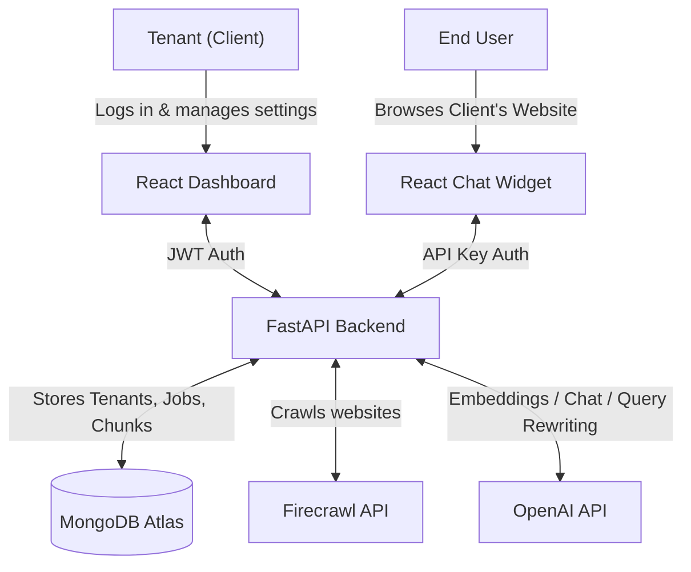
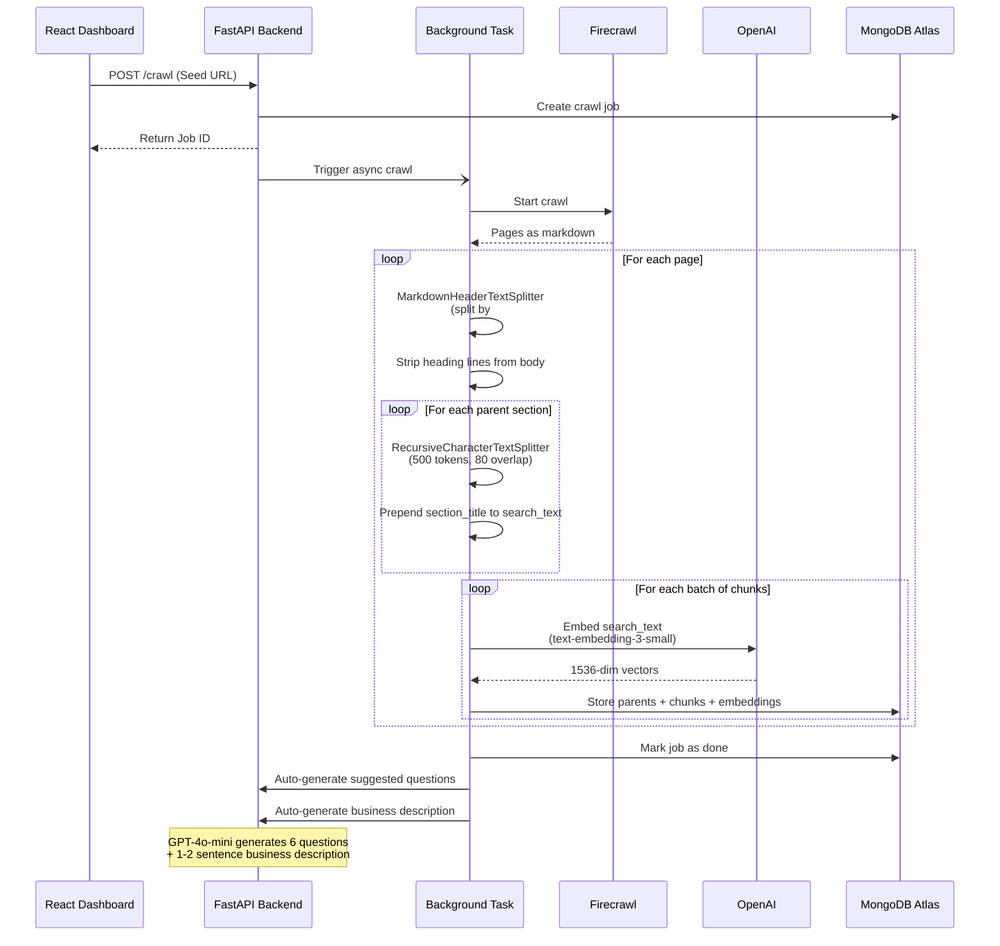
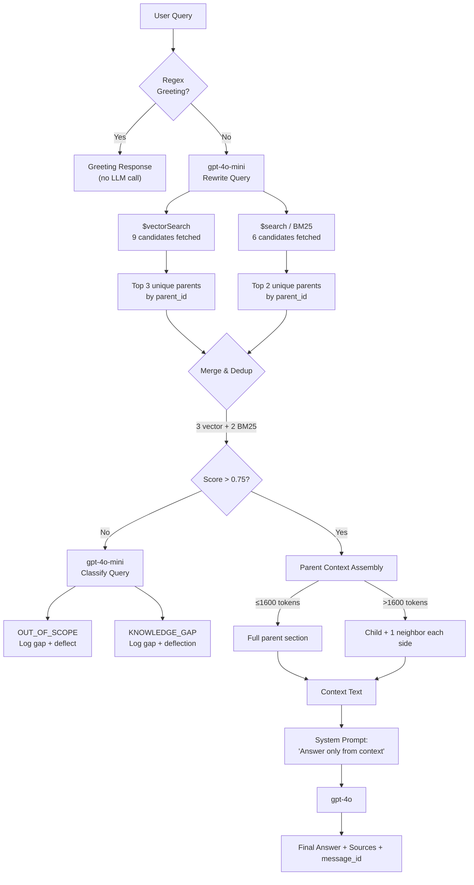
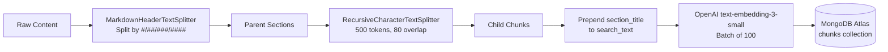
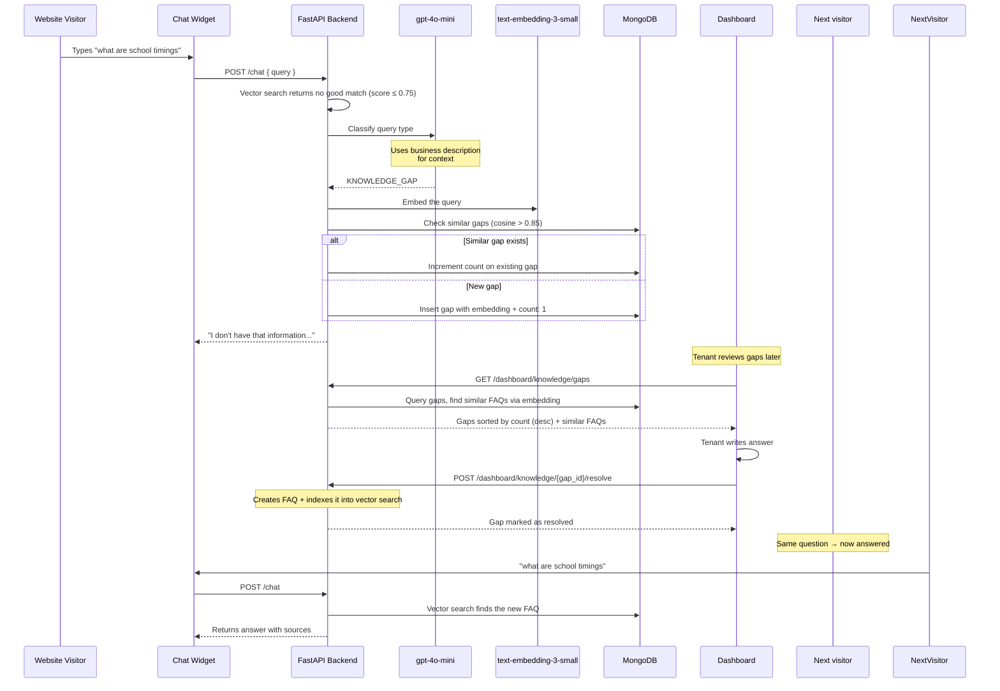

# AI Chatbot Widget SaaS

A multi-tenant SaaS platform where clients can sign up, crawl their websites, and embed an AI-powered chat widget.

## Architecture Overview

### 1. System Architecture


### 2. Chat Flow (Updated)

The chat endpoint uses a 3-step flow: greeting detection → knowledge search → classification.

```mermaid
sequenceDiagram
    participant User as Website Visitor
    participant Widget as Chat Widget
    participant API as FastAPI Backend
    participant Regex as Greeting Detector
    participant Vector as Vector Search
    participant Classifier as gpt-4o-mini
    participant GPT as gpt-4o

    User->>Widget: Types a message
    Widget->>API: POST /chat { query, session_id, api_key }
    
    Step 1: Regex Greeting Check
    API->>Regex: Check if greeting (hi, hello, etc.)
    alt Is greeting
        Regex-->>API: Match found
        API-->>Widget: "Hello! Welcome to {domain}..."
    end
    
    Step 2: LLM Rewrite + Vector Search
    API->>Classifier: Rewrite query for search
    Classifier-->>API: Rewritten search query
    
    par Vector Search (semantic)
        API->>Vector: Embed query + $vectorSearch
        Vector-->>API: Top results with scores
    and BM25 Search (keyword)
        API->>Vector: $search on text + section_title
        Vector-->>API: Top results
    end
    
    API->>API: Merge & dedup (3 vector + 2 BM25)
    
    alt Score > 0.75 (Good match)
        API->>GPT: RAG prompt with context
        GPT-->>API: Answer with citations
    else Score ≤ 0.75 (No match)
        Step 3: LLM Evaluate Reason
        API->>Classifier: Classify query type
        alt OUT_OF_SCOPE
            API-->>Widget: "I can only help with {domain}..."
            API->>API: Log gap (type: out_of_scope)
        else KNOWLEDGE_GAP
            API-->>Widget: "I don't have that info..."
            API->>API: Log gap (type: knowledge_gap)
        end
    end
    
    API->>MongoDB: Save to conversation history
    API-->>Widget: { answer, sources, message_id }
    Widget-->>User: Display answer + like/dislike buttons
```

### 3. Crawling & Indexing Flow


### 4. Hybrid Search Merge Strategy


## Prerequisites
- Docker & Docker Compose
- MongoDB Atlas cluster
- Redis server (local or hosted)
- OpenAI API Key
- Firecrawl API Key

## 1. Setup Environment
Use `.env.production.example` as the template:

```bash
cp .env.production.example .env
```

Keep the `.env` file in the project root directory. The backend loads the `.env` file from the project root.

Update the values:
```bash
MONGODB_URI=mongodb+srv://<username>:<password>@cluster0.mongodb.net/?retryWrites=true&w=majority
OPENAI_API_KEY=sk-proj-your-openai-api-key-here
FIRECRAWL_API_KEY=fc-your-firecrawl-api-key-here
JWT_SECRET=your-super-secret-jwt-key
ALLOWED_ORIGINS=http://localhost:3000,http://127.0.0.1:3000
VITE_API_BASE_URL=http://localhost:8000
REDIS_URI=redis://localhost:6379/0
```

`VITE_API_BASE_URL` is used when building the dashboard so browser requests and generated widget snippets point to the backend.

## 2. MongoDB Atlas Indexes

### Vector Search Index (`vector_index`)
Navigate to **Atlas Search** → **Create Search Index** → **Vector Search**.

- Database: `chatbot_db`, Collection: `chunks`
- Index Name: `vector_index`

```json
{
  "fields": [
    {
      "type": "vector",
      "path": "embedding",
      "numDimensions": 1536,
      "similarity": "cosine"
    },
    {
      "type": "filter",
      "path": "tenant_id"
    }
  ]
}
```

### Full-Text Search Index (`default`)
Navigate to **Atlas Search** → **Create Search Index** → **Atlas Search**.

- Database: `chatbot_db`, Collection: `chunks`
- Index Name: `default`

```json
{
  "mappings": {
    "dynamic": false,
    "fields": {
      "text": { "type": "string" },
      "section_title": { "type": "string" },
      "tenant_id": { "type": "string" }
    }
  }
}
```

The backend also creates regular MongoDB lookup indexes on startup for parent-child retrieval:
- `parents`: `tenant_id`, `parent_id`
- `chunks`: `tenant_id`, `parent_id`, `child_index`
- `pages`: `tenant_id`, `url`

## 3. Run the Platform

### Option A: Using Docker (Recommended)
Start the services using Docker Compose:
```bash
docker-compose up --build
```
This will:
- Build the widget bundle
- Start the FastAPI backend on `http://localhost:8000`
- Start the React Dashboard on `http://localhost:3000`

For deployed environments, set `VITE_API_BASE_URL` before building the dashboard so its API calls and generated widget snippet point at your backend URL.

### Option B: Without Docker (Manual Setup)
If you prefer running the services locally without Docker, you will need three separate terminal windows.

**Terminal 1: Build the Widget**
```bash
cd widget
npm install
npm run build
```

**Terminal 2: Start the Backend**
```bash
cd backend
python3 -m venv .venv
source .venv/bin/activate  # On Windows: .venv\Scripts\activate
pip install -r requirements.txt
uvicorn main:app --reload --host 0.0.0.0 --port 8000
```
*(Note: If using `uv`, you can run `uv pip install -r requirements.txt` instead of regular pip).*

**Terminal 3: Start the Dashboard**
```bash
cd dashboard
npm install
export VITE_API_BASE_URL=http://localhost:8000
npm run dev
```

## 4. Usage
1. Open the Dashboard at `http://localhost:3000`.
2. Register a new tenant.
3. Go to Settings to copy your widget script tag.
4. Go to Crawl Jobs and start a crawl of your website (e.g., `https://example.com`).
5. Add the copied script tag to your site's HTML file.
6. Interact with the chat widget!
7. Visit **Knowledge Gaps** in the dashboard to see unanswered questions and add FAQ answers to resolve them.

## 5. Testing the Widget Locally

Before deploying to a client's site, you can test the widget on a simulated website using the local dev servers.

### Quick Start

**Terminal 1 — Start the backend:**
```bash
cd backend
uvicorn main:app --reload --host 0.0.0.0 --port 8000
```

**Terminal 2 — Start the widget dev server:**
```bash
cd widget
npm run dev
```

**Terminal 3 — Open the test page:**
```bash
# macOS
open test-embed.html

# Linux
xdg-open test-embed.html

# Windows
start test-embed.html
```

The test page (`test-embed.html`) simulates a real client website with:
- The widget loaded via a `<script>` tag (same production embed flow)
- CSS variables (`--primary`, `--accent`) to test automatic theme inheritance
- A **Toggle Dark Mode** button to verify dark/light mode detection
- Sample content cards explaining what to test

### What to Test
- Click the chat bubble to open the widget — verify the glassmorphism animation
- Send a message — verify the animated typing indicator (3 bouncing dots)
- Check that the widget picks up the page's `--primary` (#6366F1) as its accent color
- Toggle dark mode — verify the widget adapts its palette automatically
- Test on narrow viewports — the widget should stay fixed at bottom-right

### Testing with a Built Widget (Production Simulation)

To test the production IIFE build instead of the Vite dev server:
```bash
cd widget
npm run build
```
Then serve the `dist/` folder and update the `<script>` src in `test-embed.html` to point to the built file:
```html
<script
  src="http://localhost:8080/widget.js"
  data-api-key="sk_live_..."
  data-api-base-url="http://localhost:8000"
></script>
```

## Extra Knowledge Sources

Beyond website crawling, the platform supports **four types** of knowledge sources. All sources feed into the same unified vector + BM25 search index per tenant.

### Source Types

| Type | Input Method | Indexing Trigger |
|------|-------------|-----------------|
| **Website** | Seed URL → Firecrawl crawls pages | Automatic (during crawl) |
| **PDF** | File upload (`.pdf`) | Automatic (on upload) |
| **FAQ** | Manual Q&A pairs via dashboard | Explicit ("Index" button) |
| **Text Document** | Free-form text / markdown via dashboard | Explicit ("Index" button) |

### Ingestion Pipeline (Common to All Sources)

All source types pass through the same pipeline in `backend/services/ingestion.py`:



1. **Section Splitting** — Content is split by markdown headings (H1–H4) into parent sections using `MarkdownHeaderTextSplitter`. Sections under 8 tokens of body text are filtered. Unstructured content becomes a single parent.
2. **Chunk Splitting** — Each parent is split into child chunks of ~500 tokens with 80-token overlap via `RecursiveCharacterTextSplitter`. Tiny chunks (< 40 tokens) are merged into neighbors.
3. **Heading Prefix** — The section title is prepended to each child chunk's `search_text` field (used for embedding only), improving semantic retrieval. The clean `text` is served as LLM context.
4. **Embedding** — Chunks are embedded in batches of 100 via OpenAI `text-embedding-3-small` (1536 dimensions), with 3 retries and exponential backoff.
5. **Storage** — Each source produces three document types in MongoDB:
   - `pages` — One document per page/document with full raw content
   - `parents` — One document per markdown section
   - `chunks` — Child chunks with embeddings (the searchable unit)

### Source Lifecycle

#### Website Crawls
- Submitted via `POST /dashboard/crawl` with a seed URL.
- Background task calls Firecrawl API (up to 200 pages), ingests each page as markdown.
- Old chunks for re-crawled URLs are automatically cleaned up (dedup by `crawl_id`).
- After crawl completes, suggested questions are auto-generated from indexed content.
- **Business description is auto-generated** from crawled content (used for query classification).

#### PDF Uploads
- Uploaded via `POST /dashboard/sources/pdf/upload`.
- Text is extracted page-by-page via PyMuPDF (`fitz`), formatted as `## Page N` markdown.
- A `sources` record is created with `status: "indexing"`, updated to `"ready"` on completion.

#### FAQs
1. Create a FAQ source container via `POST /dashboard/sources` (type: `faq`).
2. Add Q&A pairs via `POST /dashboard/sources/{source_id}/faqs`. Raw pairs stored in the `faqs` collection.
3. Click **"Index"** to trigger background ingestion — formats each as `Q: ...\nA: ...` and runs the pipeline.
4. Can re-index to pick up new or updated FAQs (clears existing indexed data first).
5. After indexing, suggested questions are auto-generated from indexed content.
6. **Knowledge Gap Resolution** — FAQs can also be created directly from the Knowledge Gaps page, which auto-indexes them and marks the gap as resolved.

#### Text Documents
1. Create a text document source container via `POST /dashboard/sources` (type: `text`).
2. Add documents (title + body) via `POST /dashboard/sources/{source_id}/docs`.
3. Click **"Index"** to trigger background ingestion — same pattern as FAQs.
4. After indexing, suggested questions are auto-generated from indexed content.

### Search-Time Behavior

- All indexed sources within a tenant are searched **together** as a single pool — there is no filtering by source type or source ID at query time.
- The hybrid search (3 vector + 2 BM25) retrieves the most relevant chunks regardless of which source type they came from.
- Sources can be deleted from the dashboard, which removes all associated chunks, parents, and pages.

## Crawl History

The dashboard provides a complete crawl history with timestamps for every crawl job.

### Features
- **Full history table** showing: Seed URL, Status, Pages Found, Chunks Created, Started At, Finished At
- **Real-time status** for the currently running job (polls every 5 seconds)
- **Color-coded status badges**: green for done, red for failed, yellow for running
- **Timestamps** for when each crawl started and finished

### API Endpoint
```
GET /dashboard/crawl/history
Authorization: Bearer <jwt_token>
```

Returns an array of crawl job objects sorted by `started_at` descending.

## Like/Dislike Feedback

Each AI response includes thumbs-up/thumbs-down buttons for visitor feedback. This data is stored for analytics.

### How It Works
1. Every chat response includes a unique `message_id`
2. Visitor clicks thumbs-up or thumbs-down on any bot message
3. Feedback is stored in the `message_feedback` collection
4. Dashboard shows feedback analytics (total likes, dislikes, like ratio)

### API Endpoint
```
POST /feedback
Authorization: Bearer <api_key>
Content-Type: application/json

{
  "message_id": "uuid",
  "session_id": "uuid",
  "rating": "like" | "dislike"
}
```

### Analytics Endpoint
```
GET /dashboard/analytics/feedback
Authorization: Bearer <jwt_token>
```

Returns:
```json
{
  "total": 150,
  "likes": 120,
  "dislikes": 30,
  "like_ratio": 80.0
}
```

## Suggested Questions (Empty Chat)

When a visitor opens the chat widget with no messages yet, suggested questions appear as clickable chips. There are two sources for these questions:

### Manual Questions (Dashboard)
- Tenant manually adds questions via the Settings page
- Stored in `tenant.suggested_questions_manual`
- **Takes priority** — if manual questions exist, they are shown instead of auto-generated ones

### Auto-Generated Questions (LLM)
- Generated automatically after crawl or FAQ/text-doc indexing completes
- Stored in `tenant.suggested_questions_auto`
- Uses GPT-4o-mini to analyze indexed content and generate 6 relevant questions
- Runs as a background task (never blocks the main flow)

### Widget Behavior
```
if manual questions exist:
    show manual questions
else:
    show auto-generated questions
else:
    show "Ask me anything about this site!"
```

### Dashboard UI (Settings Page)
- View auto-generated questions (grayed out, read-only)
- Add/edit/remove manual questions
- Save changes via `PUT /tenants/suggested-questions`

## Business Description (Auto-Generated)

Each tenant has a **business description** used by the AI to classify queries as knowledge gaps vs out-of-scope.

### How It Works
1. After a successful crawl, GPT-4o-mini analyzes the first 5 pages of content
2. Generates a 1-2 sentence description of what the business does
3. Stores it in `tenant.description`
4. Used by `_evaluate_no_match()` to provide context for classification

### Example
> "SchoolLog is India's first AI-powered school management system that provides a comprehensive ERP solution for educational institutions..."

### Manual Override
- Tenants can edit the description in **Settings → Business Description**
- Save via `PUT /tenants/description`
- Dashboard shows editable textarea with current description

### API Endpoints
```
GET  /tenants/me                          # Returns description field
PUT  /tenants/description?description=...  # Update description (JWT auth)
```

## Knowledge Improvement (Knowledge Gaps)

When the chatbot cannot answer a question — either because no relevant content was found in the knowledge base — the backend logs the query as a **knowledge gap**. Gaps are categorized by type and clustered by vector similarity.

### Gap Types

| Type | When Logged | Example |
|------|-------------|---------|
| `knowledge_gap` | Query is business-related but no answer found | "What are the school timings?" |
| `out_of_scope` | Query is completely unrelated to the business | "Who is the prime minister?" |

### Flow



### Features

- **Automatic logging** — Every unanswered query is logged with an embedding for similarity matching.
- **Two gap types** — `knowledge_gap` (business-related, missing answer) vs `out_of_scope` (unrelated to business).
- **Accurate similarity de-duplication** — Compares new queries against ALL existing open gaps, finds the MOST similar match, and increments count if cosine similarity > 0.85.
- **Similar FAQ suggestions** — When viewing a gap, the backend searches ALL FAQs with embeddings and returns the top 3 most semantically similar ones (cosine > 0.8).
- **One-click resolve** — Tenants can write an answer and select a FAQ source directly from the Knowledge Gaps page. The backend creates the FAQ pair, indexes it into the vector search pipeline, and marks the gap as resolved.
- **Cleanup duplicates** — One-click button to merge duplicate gaps with identical normalized text.
- **Union-Find clustering** — The re-cluster endpoint uses an efficient Union-Find algorithm to group similar gaps into clusters.

### Dashboard Page

Navigate to **Knowledge Gaps** in the sidebar:
- **KPIs** at the top: Knowledge Gaps count, Out of Scope count, Resolved count, Total
- **Filter tabs**: Unresolved / Resolved / All
- **Gap type tabs**: All Types | Knowledge Gaps | Out of Scope
- **Most-asked list**: top 5 unanswered questions ranked by count
- **Full gap list**: each gap shows query text, gap type badge, times asked, last-seen timestamp, and similar FAQs
- **Resolve form**: inline expandable form to create and index a FAQ answer immediately
- **Cleanup Duplicates button**: merges identical gaps with normalized text matching

### API Endpoints

```
GET  /dashboard/knowledge/gaps                          # List gaps (filter: status, gap_type)
GET  /dashboard/knowledge/gaps/stats                    # Aggregate stats + top gaps
POST /dashboard/knowledge/gaps/{gap_id}/resolve         # Resolve (action: create_faq | dismiss | merge)
POST /dashboard/knowledge/gaps/cluster                  # Re-cluster gaps by similarity (Union-Find)
POST /dashboard/knowledge/gaps/cleanup                  # Merge duplicate gaps with normalized text
```

All endpoints require JWT authentication (`Authorization: Bearer <token>`).

### Technical Details
- Similarity threshold: 0.85 (for gap deduplication)
- FAQ suggestion threshold: 0.8 (returns top 3 matches)
- Direct answer threshold: 0.75 (vector search score to return RAG answer)
- Max gaps fetched for comparison: 1000
- Embedding model: text-embedding-3-small (1536 dimensions)
- Normalization: lowercase, remove punctuation, collapse whitespace (generic, no hardcoded words)

## Lead Generation (Enquiry Form)

When a website visitor asks about pricing, demo, purchasing, or wants to be contacted, GPT-4o detects the intent and appends `[ENQUIRY_FORM]` to its response. The backend strips the marker and returns `show_enquiry_form: true`. The widget renders an inline form (Name, Email, Phone).

### Flow

```
Visitor: "How much does this cost?"
  → GPT-4o detects lead intent, appends [ENQUIRY_FORM]
  → Backend strips marker, returns show_enquiry_form: true
  → Widget shows answer + inline form
  → Visitor fills form → POST /leads → saved to MongoDB
  → gpt-4o-mini summarizes conversation context into 1-2 sentences
  → Dashboard "Leads" page lists all submissions
```

### Key Details
- **Intent detection**: Done by GPT-4o in the system prompt, not keyword matching. Works across greeting, RAG, and no-results paths.
- **Conversation summarization**: On form submit, `gpt-4o-mini` summarizes the last 3 turns of conversation into a concise description of what the lead was interested in. Raw context is also preserved (`raw_context` field).
- **No LLM call for irrelevant queries**: "Who is Virat Kohli?" gets classified as `OUT_OF_SCOPE` by the query evaluator and returns immediately — no GPT-4o call, no token waste.
- **Dashboard**: "Leads" nav item with a table showing Name, Email, Phone, Date, and the summarized message.

### Guardrails

The chatbot avoids answering irrelevant questions through vector search scoring:

1. **Vector search threshold**: If the top result score ≤ 0.75, the query is treated as "no match" and sent to the classifier.
2. **LLM classifier**: Classifies the query as `OUT_OF_SCOPE` (unrelated to business) or `KNOWLEDGE_GAP` (related but missing answer).
3. **Hardened system prompt**: The RAG prompt instructs GPT — "If the context does not contain information relevant to the user's question, say you don't have that information."

## Rate Limiting & Abuse Protection

Three layers of rate limiting protect the chat endpoint:

| Layer | Scope | Limit | Mechanism | Purpose |
|-------|-------|-------|-----------|---------|
| **Per-IP** | Client IP address | 20 req/min | slowapi (`@limiter.limit`) | Catches individual bad actors bypassing session ID |
| **Per-tenant** | API key / tenant ID | 100 req/min | In-memory sliding window (`deque`) | All real users + attackers combined. Protects costs. |
| **Per-session** | `chat_session_id` cookie | 20 req/min | In-memory sliding window (`deque`) | Stops a single abusive user |
| **Max query length** | All requests | 500 chars | Rejected with 400 | Prevents token waste on huge inputs |

The per-IP and per-session limits catch individual bad actors. The per-tenant limit is the critical defense — since the API key is visible in the widget's script tag, a distributed attack using the same key from many IPs would bypass per-IP limits but is still blocked by the per-tenant sliding window.

In-memory counters reset on server restart. For production at scale, replace with Redis-backed rate limiting.

## Session Management & History Compaction

To ensure high-performance, cost-effective conversational capability, the system integrates Redis caching alongside MongoDB storage, combined with a rolling history summarization pipeline.

### 1. In-Memory Session Caching (Redis)
- **Cache-Aside lookup**: When a chat request is received, the backend attempts to load the session history and rolling summary from Redis (`chat_session:{session_id}`).
- **MongoDB Fallback**: If a cache miss occurs, history is retrieved from MongoDB and written back to Redis with a 1-hour TTL.
- **Latency Optimization**: Reads bypass the database completely for active sessions, providing sub-millisecond context retrievals.

### 2. Semantic Context Summarization (Compaction)
- **Trigger**: When the conversation history reaches 10 messages (5 complete turns).
- **Pruning**: The last 4 messages (2 turns) are kept in full fidelity to handle immediate references (pronouns, follow-ups).
- **Summarization**: The older 6 messages are aggregated with any existing summary into a new, consolidated rolling summary using `gpt-4o-mini`.
- **Database Cap**: By trimming the active `messages` array down to 4 items and updating the document's `summary` field, MongoDB document size remains bounded at $O(1)$ size, avoiding unbounded array growth and slow updates.
- **System Prompt Injection**: The rolling summary is automatically injected into the LLM system prompt on subsequent turns.

## Key Design Decisions

### Greeting Detection (Regex Fast-Path)
Greetings like "hi", "hello", "hey" are detected via regex (~10ms) without any LLM call. This is faster and cheaper than the previous LLM-based classification.

### Vector Search Before Classification
Instead of classifying queries first (which skipped knowledge base lookups for out-of-scope queries), the system now:
1. Searches the knowledge base first
2. Only classifies if no good match found (score ≤ 0.75)

This ensures answers from PDFs, FAQs, and crawled content are always found, even for queries that might be misclassified.

### Hybrid Search (Vector + BM25)
- **3 guaranteed slots** from vector search (semantic matching via `$vectorSearch`)
- **2 guaranteed slots** from BM25 full-text search (keyword matching via `$search`)
- Results are deduplicated by `parent_id`
- If BM25 doesn't fill its 2 slots, remaining slots are filled from vector results
- Both searches run in parallel via `asyncio.gather`

### Heading Prefix in Embeddings
Section titles (e.g., *"Bus Tracking"*) are prepended to child chunk text before embedding (stored as `search_text`). The body text alone (*"Track school buses in real-time"*) misses the most descriptive keywords. The prefix is only used for embedding — the clean `text` field is served to GPT as context.

### Direct Answer Threshold (0.75)
Vector search scores above 0.75 return a RAG answer directly. Below 0.75, the query is sent to the LLM classifier to determine if it's out-of-scope or a knowledge gap.

### Empty Context Guard
If search returns zero results for a non-greeting query, the system classifies the query and returns an appropriate response — without calling GPT-4o for a RAG answer — preventing hallucination.

## Tech Stack

| Component | Technology |
|---|---|
| Backend | Python 3.12+, FastAPI, Uvicorn |
| Database | MongoDB Atlas (Motor async driver) |
| Cache | Redis (redis-py async client) |
| Embeddings | OpenAI `text-embedding-3-small` |
| Chat LLM | OpenAI `gpt-4o` |
| Query Rewriting | OpenAI `gpt-4o-mini` |
| Query Classification | OpenAI `gpt-4o-mini` |
| Business Description | OpenAI `gpt-4o-mini` |
| Suggested Questions | OpenAI `gpt-4o-mini` |
| Crawling | Firecrawl API |
| Auth | JWT (python-jose) + API keys (bcrypt) |
| Frontend (Dashboard) | React 18, Vite |
| Frontend (Widget) | React 18, Vite (embedded as script tag) |
| Chunking | LangChain (MarkdownHeaderTextSplitter + RecursiveCharacterTextSplitter) |
| Token Counting | tiktoken (`cl100k_base`) |
| Rate Limiting | slowapi |
| Containerization | Docker Compose |

## API Endpoints

| Method | Endpoint | Auth | Description |
|---|---|---|---|
| POST | `/chat` | API Key | Chat with the widget (returns `message_id`) |
| POST | `/feedback` | API Key | Submit like/dislike feedback for a message |
| GET | `/widget/config` | API Key | Get widget config (theme + suggested questions) |
| POST | `/tenants/register` | None | Register a new tenant |
| POST | `/tenants/login` | None | Login |
| GET | `/tenants/me` | JWT | Get tenant info + suggested questions |
| GET | `/tenants/stats` | JWT | Tenant stats |
| POST | `/tenants/rotate-key` | JWT | Rotate API key |
| PUT | `/tenants/suggested-questions` | JWT | Save manual suggested questions |
| PUT | `/tenants/description` | JWT | Update business description |
| GET | `/dashboard/analytics/feedback` | JWT | Get feedback analytics |
| POST | `/crawl` | API Key | Start a crawl job |
| GET | `/crawl/{job_id}` | API Key | Check crawl status |
| DELETE | `/index` | API Key | Delete indexed data |
| POST | `/dashboard/crawl` | JWT | Start a crawl (dashboard) |
| GET | `/dashboard/crawl/{job_id}` | JWT | Check crawl status (dashboard) |
| GET | `/dashboard/crawl/history` | JWT | Get crawl history with timestamps |
| DELETE | `/dashboard/index` | JWT | Delete indexed data (dashboard) |
| GET | `/dashboard/sources` | JWT | List all knowledge sources |
| POST | `/dashboard/sources` | JWT | Create a source container |
| GET | `/dashboard/sources/{source_id}` | JWT | Get source details + chunk count |
| DELETE | `/dashboard/sources/{source_id}` | JWT | Delete source + indexed data |
| POST | `/dashboard/sources/pdf/upload` | JWT | Upload and index a PDF |
| GET | `/dashboard/sources/{source_id}/faqs` | JWT | List FAQs in a source |
| POST | `/dashboard/sources/{source_id}/faqs` | JWT | Add a FAQ pair |
| PUT | `/dashboard/sources/{source_id}/faqs/{faq_id}` | JWT | Update a FAQ |
| DELETE | `/dashboard/sources/{source_id}/faqs/{faq_id}` | JWT | Delete a FAQ + its chunks |
| POST | `/dashboard/sources/{source_id}/faqs/index` | JWT | Index all FAQs for search |
| GET | `/dashboard/sources/{source_id}/docs` | JWT | List text documents in a source |
| POST | `/dashboard/sources/{source_id}/docs` | JWT | Create a text document |
| PUT | `/dashboard/sources/{source_id}/docs/{doc_id}` | JWT | Update a text document |
| DELETE | `/dashboard/sources/{source_id}/docs/{doc_id}` | JWT | Delete a text document + its chunks |
| POST | `/dashboard/sources/{source_id}/docs/index` | JWT | Index all text documents for search |
| GET | `/dashboard/knowledge/gaps` | JWT | List knowledge gaps (filter: status, gap_type) |
| GET | `/dashboard/knowledge/gaps/stats` | JWT | Get gap stats + top unanswered questions |
| POST | `/dashboard/knowledge/gaps/{gap_id}/resolve` | JWT | Resolve a gap (create_faq, dismiss, or merge) |
| POST | `/dashboard/knowledge/gaps/cluster` | JWT | Re-cluster open gaps by vector similarity |
| POST | `/dashboard/knowledge/gaps/cleanup` | JWT | Merge duplicate gaps with normalized text |

## Database Collections

| Collection | Purpose |
|---|---|
| `tenants` | Tenant accounts, API keys, description, suggested questions config |
| `pages` | Raw crawled page content |
| `parents` | Parent sections from markdown heading splits |
| `chunks` | Child chunks with embeddings (searchable unit) |
| `sources` | Knowledge source metadata |
| `crawl_jobs` | Crawl job status and history |
| `conversations` | Chat conversation history |
| `visitors` | Visitor tracking (IP, page views, messages) |
| `faqs` | FAQ Q&A pairs |
| `documents` | Text document content |
| `leads` | Enquiry form submissions |
| `message_feedback` | Like/dislike feedback on AI responses |
| `knowledge_gaps` | Unanswered queries with embeddings, gap_type, and similarity clustering |
