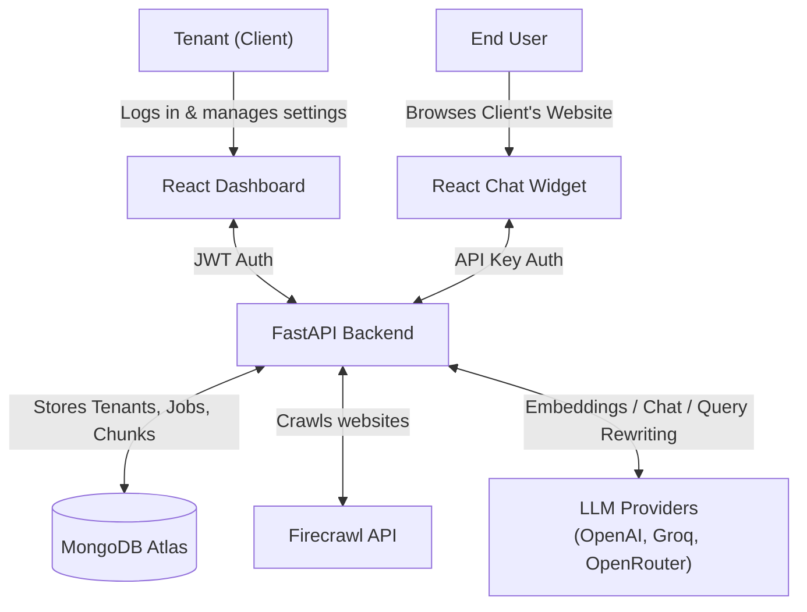
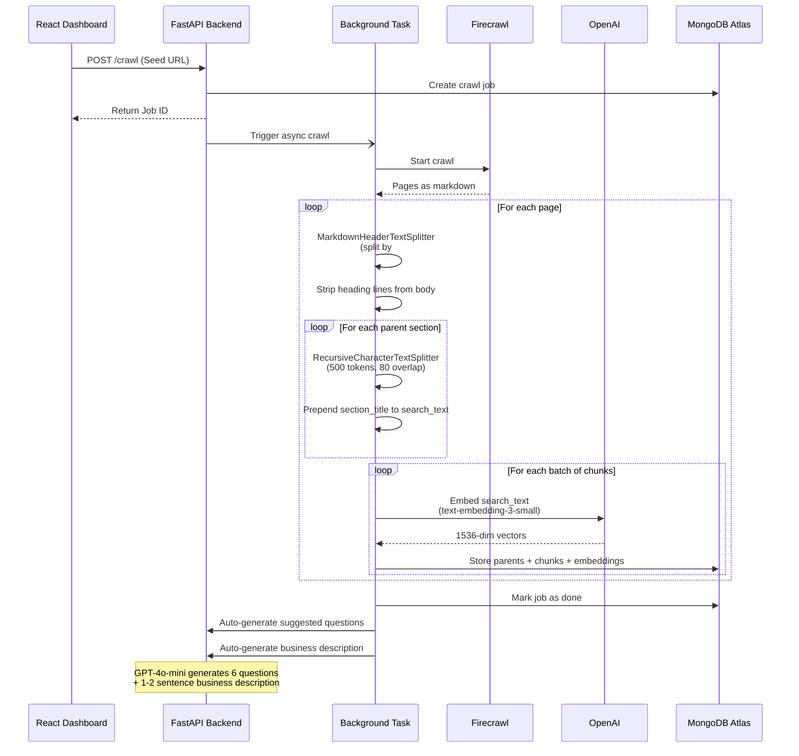
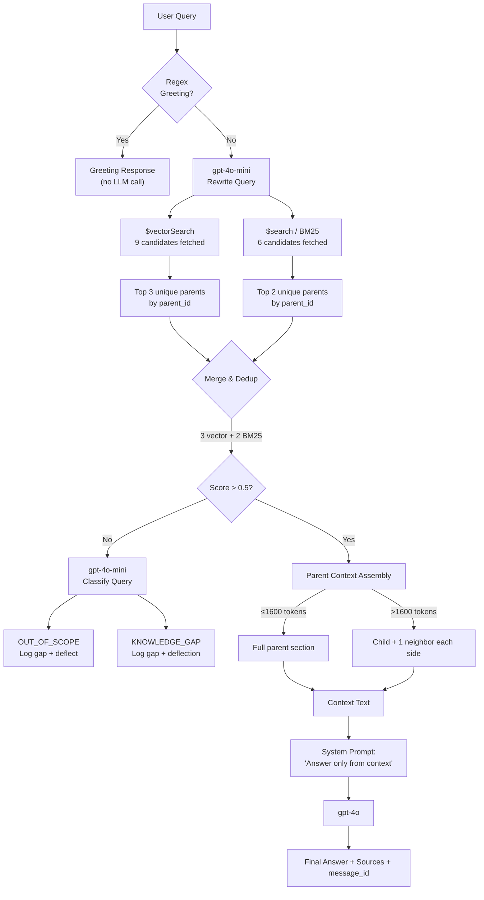
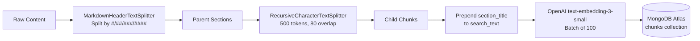
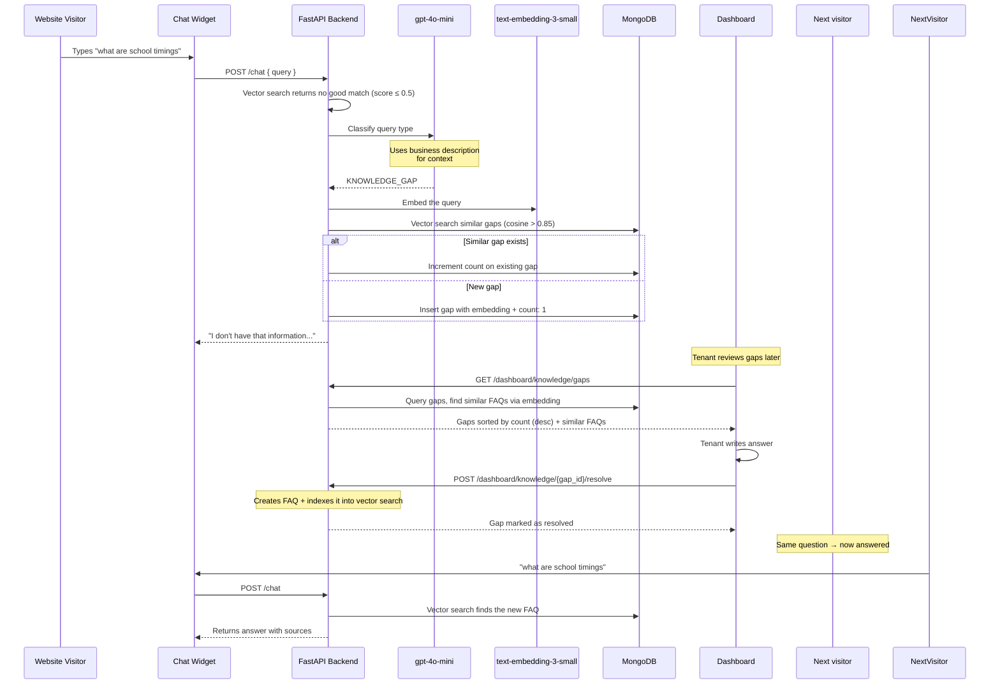

# AI Chatbot Widget SaaS

A multi-tenant SaaS platform where clients can sign up, crawl their websites, and embed an AI-powered chat widget.

## Architecture Overview

### 1. System Architecture


### 2. Chat Flow (Updated)

The chat endpoint uses a 3-step flow: greeting detection → knowledge search → classification.

```mermaid
sequenceDiagram
    participant User as Website Visitor
    participant Widget as Chat Widget
    participant API as FastAPI Backend
    participant Regex as Greeting Detector
    participant Vector as Vector Search
    participant Classifier as gpt-4o-mini
    participant GPT as gpt-4o

    User->>Widget: Types a message
    Widget->>API: POST /chat { query, session_id, api_key }
    
    Step 1: Regex Greeting Check
    API->>Regex: Check if greeting (hi, hello, etc.)
    alt Is greeting
        Regex-->>API: Match found
        alt Has visitor identity name
            API->>DB: Lookup visitor identity
            DB-->>API: {name: "John"}
            API-->>Widget: "Hi John, welcome back to {domain}..."
        else Anonymous visitor
            API-->>Widget: "Hello! Welcome to {domain}..."
        end
    end
    
    Step 2: LLM Rewrite + Vector Search
    API->>Classifier: Rewrite query for search
    Classifier-->>API: Rewritten search query
    
    par Vector Search (semantic)
        API->>Vector: Embed query + $vectorSearch
        Vector-->>API: Top results with scores
    and BM25 Search (keyword)
        API->>Vector: $search on text + section_title
        Vector-->>API: Top results
    end
    
    API->>API: Merge & dedup (3 vector + 2 BM25)
    
    alt Score > 0.5 (Good match)
        API->>GPT: RAG prompt with context
        GPT-->>API: Answer with citations
    else Score ≤ 0.5 (No match)
        Step 3: LLM Evaluate Reason
        API->>Classifier: Classify query type
        alt OUT_OF_SCOPE
            API-->>Widget: "I can only help with {domain}..."
            API->>API: Log gap (type: out_of_scope)
        else KNOWLEDGE_GAP
            API-->>Widget: "I don't have that info..."
            API->>API: Log gap (type: knowledge_gap)
        end
    end
    
    API->>MongoDB: Save to conversation history
    API-->>Widget: { answer, sources, message_id }
    Widget-->>User: Display answer + like/dislike buttons
```

### 3. Crawling & Indexing Flow


### 4. Hybrid Search Merge Strategy


## Prerequisites
- Node.js & pnpm
- Python 3.12+ (with uv package manager)
- MongoDB Atlas cluster
- Redis server (local or hosted)
- OpenAI API Key
- Firecrawl API Key

## 1. Setup Environment
Use `.env.production.example` as the template:

```bash
cp .env.production.example .env
```

Keep the `.env` file in the project root directory. The backend loads the `.env` file from the project root (priority: `.env.production` > `.env.staging` > `.env`).

Update the values:
```bash
# Required
MONGODB_URI=mongodb+srv://<username>:<password>@cluster0.mongodb.net/?retryWrites=true&w=majority
OPENAI_API_KEY=sk-proj-your-openai-api-key-here
FIRECRAWL_API_KEY=fc-your-firecrawl-api-key-here
JWT_SECRET=your-super-secret-jwt-key
REDIS_URI=redis://localhost:6379/0

# CORS & Auth
ALLOWED_ORIGINS=http://localhost:3000,http://127.0.0.1:3000
COOKIE_SECURE=False
COOKIE_SAMESITE=lax
ENFORCE_DOMAIN=False

# Dashboard build config
VITE_API_BASE_URL=http://localhost:8000

# Optional
APP_ENV=development
MAX_CRAWL_PAGES=100
PUBLIC_URL=

# LLM Providers (optional — enables multi-provider support)
GROQ_API_KEY=gsk_your-groq-api-key-here
OPENROUTER_API_KEY=sk-or-your-openrouter-api-key-here

# Admin credentials (defaults shown)
ADMIN_USERNAME=admin
ADMIN_PASSWORD=admin123
```

## 2. MongoDB Atlas Indexes

### LLM Providers

The backend supports multiple LLM providers via LangChain. Each tenant can configure their own provider and model from the **Settings** page in the dashboard.

| Provider | API Key Env Var | Base URL | Models |
|---|---|---|---|
| **OpenAI** (default) | `OPENAI_API_KEY` | `https://api.openai.com/v1` | `gpt-4o`, `gpt-4o-mini`, `gpt-4o-turbo`, `gpt-3.5-turbo` |
| **Groq** | `GROQ_API_KEY` | `https://api.groq.com/openai/v1` | `llama-3.1-8b-instant`, `llama-3.1-70b-versatile`, `mixtral-8x7b-32768` |
| **OpenRouter** | `OPENROUTER_API_KEY` | `https://openrouter.ai/api/v1` | `anthropic/claude-3-haiku`, `meta-llama/llama-3.1-8b-instant`, `google/gemini-2.0-flash-001` |

**How it works:**
- Tenant settings stored in `tenant.ai` field (`{ provider: "openai", model: "gpt-4o-mini" }`)
- Factory pattern in `backend/services/llm/factory.py` creates provider-specific clients
- All LLM calls (chat, classification, rewriting) route through the configured provider
- Falls back to OpenAI `gpt-4o-mini` if provider init fails

### Vector Search Index (`vector_index`)
Navigate to **Atlas Search** → **Create Search Index** → **Vector Search**.

- Database: `chatbot_db`, Collection: `chunks`
- Index Name: `vector_index`

```json
{
  "fields": [
    {
      "type": "vector",
      "path": "embedding",
      "numDimensions": 1536,
      "similarity": "cosine"
    },
    {
      "type": "filter",
      "path": "tenant_id"
    }
  ]
}
```

### Full-Text Search Index (`default`)
Navigate to **Atlas Search** → **Create Search Index** → **Atlas Search**.

- Database: `chatbot_db`, Collection: `chunks`
- Index Name: `default`

```json
{
  "mappings": {
    "dynamic": false,
    "fields": {
      "text": { "type": "string" },
      "section_title": { "type": "string" },
      "tenant_id": { "type": "string" }
    }
  }
}
```

### Knowledge Gaps Vector Index (`knowledge_gaps_vector_index`)
Navigate to **Atlas Search** → **Create Search Index** → **Vector Search**.

- Database: `chatbot_db`, Collection: `knowledge_gaps`
- Index Name: `knowledge_gaps_vector_index`

```json
{
  "fields": [
    {
      "type": "vector",
      "path": "embedding",
      "numDimensions": 1536,
      "similarity": "cosine"
    },
    {
      "type": "filter",
      "path": "tenant_id"
    },
    {
      "type": "filter",
      "path": "status"
    }
  ]
}
```

### FAQs Vector Index (`faqs_vector_index`)
Navigate to **Atlas Search** → **Create Search Index** → **Vector Search**.

- Database: `chatbot_db`, Collection: `faqs`
- Index Name: `faqs_vector_index`

```json
{
  "fields": [
    {
      "type": "vector",
      "path": "embedding",
      "numDimensions": 1536,
      "similarity": "cosine"
    },
    {
      "type": "filter",
      "path": "tenant_id"
    }
  ]
}
```

The backend creates MongoDB indexes on startup for efficient queries:

| Collection | Index | Type |
|---|---|---|
| `parents` | `(tenant_id, parent_id)` | Compound |
| `parents` | `(tenant_id, source_id)` | Compound |
| `chunks` | `(tenant_id, parent_id, child_index)` | Compound |
| `chunks` | `(tenant_id, source_id)` | Compound |
| `pages` | `(tenant_id, url)` | Compound |
| `pages` | `(tenant_id, source_id)` | Compound |
| `visitors` | `session_id` | Single |
| `visitors` | `(tenant_id, visitor_id)` | Compound |
| `visitors` | `last_seen_at` | Single |
| `tenants` | `tenant_id` | Unique |
| `tenants` | `api_key` | Unique |
| `tenants` | `domain` | Single |
| `conversations` | `session_id` | Single |
| `crawl_jobs` | `(job_id, tenant_id)` | Compound |
| `sources` | `(tenant_id, source_id)` | Compound |
| `faqs` | `(tenant_id, source_id, faq_id)` | Compound |
| `documents` | `(tenant_id, source_id, doc_id)` | Compound |
| `leads` | `(tenant_id, created_at DESC)` | Compound |
| `lead_form_configs` | `(tenant_id, form_id)` | Compound |
| `lead_form_configs` | `(tenant_id, enabled)` | Compound |
| `knowledge_gaps` | `(tenant_id, status)` | Compound |
| `knowledge_gaps` | `(tenant_id, cluster_id)` | Compound |
| `source_jobs` | `(tenant_id, source_id, started_at DESC)` | Compound |
| `source_jobs` | `(tenant_id, job_type)` | Compound |

## 3. Run the Platform

You can run the monorepo locally with pnpm and uv.

### Installation
From the root directory, install all frontend dependencies:
```bash
pnpm install
```

### Running the Services
Start all servers (Backend + Dashboard + Widget dev server) concurrently:
```bash
pnpm dev
```
This will start:
- FastAPI backend on `http://localhost:8000`
- React Dashboard on `http://localhost:3000`
- React Chat Widget dev server on `http://localhost:5174`

If you prefer to run services manually, you can use:
- **Run Backend:** `pnpm dev:backend`
- **Run Dashboard:** `pnpm dev:dashboard`
- **Run Widget:** `pnpm dev:widget`

## 4. Usage
1. Open the Dashboard at `http://localhost:3000/dashboard/`.
2. Register a new tenant.
3. Go to Settings to copy your widget script tag.
4. Go to Crawl Jobs and start a crawl of your website (e.g., `https://example.com`).
5. Add the copied script tag to your site's HTML file.
6. Interact with the chat widget!
7. Visit **Knowledge Gaps** in the dashboard to see unanswered questions and add FAQ answers to resolve them.

## 5. Testing the Widget Locally

Before deploying to a client's site, you can test the widget on a simulated website using the local dev servers.

### Quick Start

**Terminal 1 — Start the backend:**
```bash
cd backend
uvicorn main:app --reload --host 0.0.0.0 --port 8000
```

**Terminal 2 — Start the widget dev server:**
```bash
pnpm --filter widget dev
```

**Terminal 3 — Open the test page:**
```bash
# macOS
open backend/templates/test_page.html

# Linux
xdg-open backend/templates/test_page.html

# Windows
start backend/templates/test_page.html
```

The test page (`backend/templates/test_page.html`) simulates a real client website with:
- The widget loaded via a `<script>` tag (same production embed flow)
- CSS variables (`--primary`, `--accent`) to test automatic theme inheritance
- A **Toggle Dark Mode** button to verify dark/light mode detection
- Sample content cards explaining what to test

### What to Test
- Click the chat bubble to open the widget — verify the glassmorphism animation
- Send a message — verify the animated typing indicator (3 bouncing dots)
- Check that the widget picks up the page's `--primary` (#6366F1) as its accent color
- Toggle dark mode — verify the widget adapts its palette automatically
- Test on narrow viewports — the widget should stay fixed at bottom-right

### Testing with a Built Widget (Production Simulation)

To test the production IIFE build instead of the Vite dev server:
```bash
pnpm --filter widget build
```
Then serve the `dist/` folder and update the `<script>` src in `backend/templates/test_page.html` to point to the built file:
```html
<script
  src="http://localhost:8080/widget.js"
  data-api-key="sk_live_..."
  data-api-base-url="http://localhost:8000"
></script>
```

## Extra Knowledge Sources

Beyond website crawling, the platform supports **four types** of knowledge sources. All sources feed into the same unified vector + BM25 search index per tenant.

### Source Types

| Type | Input Method | Indexing Trigger |
|------|-------------|-----------------|
| **Website** | Seed URL → Firecrawl crawls pages | Automatic (during crawl) |
| **PDF** | File upload (`.pdf`) | Automatic (on upload) |
| **FAQ** | Manual Q&A pairs via dashboard | Explicit ("Index" button) |
| **Text Document** | Free-form text / markdown via dashboard | Explicit ("Index" button) |

### Ingestion Pipeline (Common to All Sources)

All source types pass through the same pipeline in `backend/services/ingestion.py`:



1. **Section Splitting** — Content is split by markdown headings (H1–H4) into parent sections using `MarkdownHeaderTextSplitter`. Sections under 8 tokens of body text are filtered. Unstructured content becomes a single parent.
2. **Chunk Splitting** — Each parent is split into child chunks of ~500 tokens with 80-token overlap via `RecursiveCharacterTextSplitter`. Tiny chunks (< 40 tokens) are merged into neighbors.
3. **Heading Prefix** — The section title is prepended to each child chunk's `search_text` field (used for embedding only), improving semantic retrieval. The clean `text` is served as LLM context.
4. **Embedding** — Chunks are embedded in batches of 100 via OpenAI `text-embedding-3-small` (1536 dimensions), with 3 retries and exponential backoff.
5. **Storage** — Each source produces three document types in MongoDB:
   - `pages` — One document per page/document with full raw content
   - `parents` — One document per markdown section
   - `chunks` — Child chunks with embeddings (the searchable unit)

### Source Lifecycle

#### Website Crawls
- Submitted via `POST /dashboard/crawl` with a seed URL.
- Background task calls Firecrawl API (up to 200 pages), ingests each page as markdown.
- Old chunks for re-crawled URLs are automatically cleaned up (dedup by `crawl_id`).
- After crawl completes, suggested questions are auto-generated from indexed content.
- **Business description is auto-generated** from crawled content (used for query classification).

#### PDF Uploads
- Uploaded via `POST /dashboard/sources/pdf/upload`.
- Text is extracted page-by-page via PyMuPDF (`fitz`), formatted as `## Page N` markdown.
- A `sources` record is created with `status: "indexing"`, updated to `"ready"` on completion.

#### FAQs
1. Create a FAQ source container via `POST /dashboard/sources` (type: `faq`).
2. Add Q&A pairs via `POST /dashboard/sources/{source_id}/faqs`. Raw pairs stored in the `faqs` collection.
3. Click **"Index"** to trigger background ingestion — formats each as `Q: ...\nA: ...` and runs the pipeline.
4. Can re-index to pick up new or updated FAQs (clears existing indexed data first).
5. After indexing, suggested questions are auto-generated from indexed content.
6. **Knowledge Gap Resolution** — FAQs can also be created directly from the Knowledge Gaps page, which auto-indexes them and marks the gap as resolved.

#### Text Documents
1. Create a text document source container via `POST /dashboard/sources` (type: `text`).
2. Add documents (title + body) via `POST /dashboard/sources/{source_id}/docs`.
3. Click **"Index"** to trigger background ingestion — same pattern as FAQs.
4. After indexing, suggested questions are auto-generated from indexed content.

### Search-Time Behavior

- All indexed sources within a tenant are searched **together** as a single pool — there is no filtering by source type or source ID at query time.
- The hybrid search (3 vector + 2 BM25) retrieves the most relevant chunks regardless of which source type they came from.
- Sources can be deleted from the dashboard, which removes all associated chunks, parents, and pages.

## Crawl History

The dashboard provides a complete crawl history with timestamps for every crawl job.

### Features
- **Full history table** showing: Seed URL, Status, Pages Found, Chunks Created, Started At, Finished At
- **Real-time status** for the currently running job (polls every 5 seconds)
- **Color-coded status badges**: green for done, red for failed, yellow for running
- **Timestamps** for when each crawl started and finished

### API Endpoint
```
GET /dashboard/crawl/history
Authorization: Bearer <jwt_token>
```

Returns an array of crawl job objects sorted by `started_at` descending.

## Like/Dislike Feedback

Each AI response includes thumbs-up/thumbs-down buttons for visitor feedback. This data is stored for analytics.

### How It Works
1. Every chat response includes a unique `message_id`
2. Visitor clicks thumbs-up or thumbs-down on any bot message
3. Feedback is stored in the `message_feedback` collection
4. Dashboard shows feedback analytics (total likes, dislikes, like ratio)

### API Endpoint
```
POST /feedback
Authorization: Bearer <api_key>
Content-Type: application/json

{
  "message_id": "uuid",
  "session_id": "uuid",
  "rating": "like" | "dislike"
}
```

### Analytics Endpoint
```
GET /dashboard/analytics/feedback
Authorization: Bearer <jwt_token>
```

Returns:
```json
{
  "total": 150,
  "likes": 120,
  "dislikes": 30,
  "like_ratio": 80.0
}
```

## Suggested Questions (Empty Chat)

When a visitor opens the chat widget with no messages yet, suggested questions appear as clickable chips. There are two sources for these questions:

### Manual Questions (Dashboard)
- Tenant manually adds questions via the Settings page
- Stored in `tenant.suggested_questions_manual`
- **Takes priority** — if manual questions exist, they are shown instead of auto-generated ones

### Auto-Generated Questions (LLM)
- Generated automatically after crawl or FAQ/text-doc indexing completes
- Stored in `tenant.suggested_questions_auto`
- Uses GPT-4o-mini to analyze indexed content and generate 6 relevant questions
- Runs as a background task (never blocks the main flow)

### Widget Behavior
```
if manual questions exist:
    show manual questions
else:
    show auto-generated questions
else:
    show "Ask me anything about this site!"
```

### Dashboard UI (Settings Page)
- View auto-generated questions (grayed out, read-only)
- Add/edit/remove manual questions
- Save changes via `PUT /tenants/suggested-questions`

## Business Description (Auto-Generated)

Each tenant has a **business description** used by the AI to classify queries as knowledge gaps vs out-of-scope.

### How It Works
1. After a successful crawl, GPT-4o-mini analyzes the first 5 pages of content
2. Generates a 1-2 sentence description of what the business does
3. Stores it in `tenant.description`
4. Used by `_evaluate_no_match()` to provide context for classification

### Example
> "SchoolLog is India's first AI-powered school management system that provides a comprehensive ERP solution for educational institutions..."

### Manual Override
- Tenants can edit the description in **Settings → Business Description**
- Save via `PUT /tenants/description`
- Dashboard shows editable textarea with current description

### API Endpoints
```
GET  /tenants/me                          # Returns description field
PUT  /tenants/description?description=...  # Update description (JWT auth)
```

## Knowledge Improvement (Knowledge Gaps)

When the chatbot cannot answer a question — either because no relevant content was found in the knowledge base — the backend logs the query as a **knowledge gap**. Gaps are categorized by type and clustered by vector similarity.

### Gap Types

| Type | When Logged | Example |
|------|-------------|---------|
| `knowledge_gap` | Query is business-related but no answer found | "What are the school timings?" |
| `out_of_scope` | Query is completely unrelated to the business | "Who is the prime minister?" |

### Flow



### Features

- **Automatic logging** — Every unanswered query is logged with an embedding for similarity matching.
- **Two gap types** — `knowledge_gap` (business-related, missing answer) vs `out_of_scope` (unrelated to business).
- **Vector similarity de-duplication** — New queries matched against existing open gaps via MongoDB Atlas vector search (cosine > 0.85). Falls back to brute-force if vector index is unavailable.
- **Similar FAQ suggestions** — When viewing a gap, the backend uses MongoDB Atlas vector search to find the top 3 most semantically similar FAQs (cosine > 0.8).
- **One-click resolve** — Tenants can write an answer and select a FAQ source directly from the Knowledge Gaps page. The backend creates the FAQ pair, indexes it into the vector search pipeline, and marks the gap as resolved.
- **Cleanup duplicates** — One-click button to merge duplicate gaps with identical normalized text.
- **Union-Find clustering** — The re-cluster endpoint uses an efficient Union-Find algorithm to group similar gaps into clusters.

### Dashboard Page

Navigate to **Knowledge Gaps** in the sidebar:
- **KPIs** at the top: Knowledge Gaps count, Out of Scope count, Resolved count, Total
- **Filter tabs**: Unresolved / Resolved / All
- **Gap type tabs**: All Types | Knowledge Gaps | Out of Scope
- **Most-asked list**: top 5 unanswered questions ranked by count
- **Full gap list**: each gap shows query text, gap type badge, times asked, last-seen timestamp, and similar FAQs
- **Resolve form**: inline expandable form to create and index a FAQ answer immediately
- **Cleanup Duplicates button**: merges identical gaps with normalized text matching

### API Endpoints

```
GET  /dashboard/knowledge/gaps                          # List gaps (filter: status, gap_type)
GET  /dashboard/knowledge/gaps/stats                    # Aggregate stats + top gaps
POST /dashboard/knowledge/gaps/{gap_id}/resolve         # Resolve (action: create_faq | dismiss | merge)
POST /dashboard/knowledge/gaps/cluster                  # Re-cluster gaps by similarity (Union-Find)
POST /dashboard/knowledge/gaps/cleanup                  # Merge duplicate gaps with normalized text
```

All endpoints require JWT authentication (`Authorization: Bearer <token>`).

### Technical Details
- Similarity threshold: 0.85 (for gap deduplication via vector search)
- FAQ suggestion threshold: 0.8 (returns top 3 matches via vector search)
- Direct answer threshold: 0.5 (vector search score to return RAG answer)
- Embedding model: text-embedding-3-small (1536 dimensions)
- Vector search indexes: `knowledge_gaps_vector_index` (knowledge_gaps), `faqs_vector_index` (faqs)
- Normalization: lowercase, remove punctuation, collapse whitespace (generic, no hardcoded words)

## Lead Generation (Enquiry Form)

The platform includes a **dynamic lead form builder** that lets tenants create custom lead capture forms with configurable fields, validation, and trigger instructions.

### How It Works

1. **Form Builder** (Dashboard) — Tenants create lead forms via **Leads → Form Builder** tab. They can:
   - Add any number of fields (text, email, phone, textarea, dropdown, checkbox)
   - Mark fields as required or optional
   - Set custom labels and placeholders
   - Configure **trigger instructions** — natural language rules telling the AI when to show the form
   - Enable/disable the form entirely

2. **Widget Rendering** — On load, the widget fetches active form configs from `GET /widget/lead-forms`. The LLM is bound with a `show_enquiry_form` tool containing the tenant's available forms. When the LLM detects lead intent, it emits a `tool_call` with the relevant `form_id`. The backend validates the form exists and is enabled before sending it to the widget.

3. **Lead Storage** — On form submit, all field values are stored as `custom_fields` (a flexible `Record<string, string>`), along with the AI-summarized conversation context.

### Flow

```
Tenant: Configures form in Dashboard → Leads → Form Builder
  → Sets fields (name, email, company, budget, etc.)
  → Sets trigger instructions: "the user is asking about pricing, demo, or wants a consultation"
  → Saves form config to MongoDB

Visitor: "Can I get a quote for 50 users?"
  → LLM receives tool binding with available forms + trigger descriptions
  → LLM streams text response normally
  → LLM emits show_enquiry_form tool_call with form_id
  → Backend validates form_id exists and is enabled
  → Backend sends { type: "enquiry_form", form_id: "..." } to widget
  → Widget fetches form config, renders dynamic form
  → Visitor fills form → POST /leads → saved to MongoDB with custom_fields
  → Dashboard "Leads" page lists all submissions
```

### Form Builder Features

| Feature | Description |
|---|---|
| **Field Types** | Text, Email, Phone, Textarea, Dropdown (select), Checkbox |
| **Required/Optional** | Toggle per-field validation |
| **Custom Labels** | Any label (e.g., "Company Name", "Budget Range") |
| **Placeholder Text** | Custom placeholder per field |
| **Dropdown Options** | Configurable options for select fields |
| **Field Ordering** | Drag to reorder fields |
| **Trigger Instructions** | Natural language rules for when to show the form |
| **Enable/Disable** | Toggle form on/off without deleting |
| **Backward Compatible** | Falls back to default 3-field form if no config exists |

### Key Details
- **Intent detection via tool calling**: The LLM is bound with a `show_enquiry_form` tool whose schema includes the tenant's available forms and their trigger instructions in the `description` field. The LLM decides autonomously whether to call the tool based on user intent — no text markers or sentinel strings involved.
- **Form validation**: The backend validates `form_id` against MongoDB before sending `enquiry_form` to the widget. Disabled or non-existent forms are silently skipped.
- **Error boundary**: A React `ErrorBoundary` wraps the enquiry form render in the widget, preventing a form rendering crash from killing the entire WebSocket connection.
- **Conversation summarization**: On form submit, `gpt-4o-mini` summarizes the conversation context into a concise description of what the lead was interested in. Raw context is also preserved (`raw_context` field).
- **Dynamic field storage**: All custom field values are stored in `custom_fields` as a flat key-value map, making it flexible for any form configuration.

### Dashboard UI

Navigate to **Leads** in the sidebar:
- **View Leads tab** — Table of all submissions with Name, Email, Phone, Message, Date, and visitor profile badge
- **Form Builder tab** — Create and configure lead forms with a visual builder, including field-to-identity mapping (Name/Email/Phone)

### Visitor Identity Capture via Lead Forms

When a lead form is submitted, if any field has a `field_role` of `name`, `email`, or `phone`, the visitor's identity is automatically synced to the `visitors` collection:

1. **Field Role Mapping**: In the Form Builder, each field can be mapped to a role: **None**, **Name**, **Email**, or **Phone**.
2. **Identity Upsert**: On lead submission, the backend resolves the `field_role` from the form config and upserts the visitor's identity (`name`, `email`, `phone`, `source_lead_id`) into the `visitors` document.
3. **Personalized Greeting**: On subsequent visits, the chat greeting becomes `"Hi {name}, welcome back to {domain}..."` when a known identity exists.
4. **Identity Context**: The visitor's name is injected into the LLM system prompt for context-aware conversations.
5. **Manual Override**: Dashboard admins can edit or clear a visitor's identity via the **Visitor Profiles** page.

### Guardrails

The chatbot avoids answering irrelevant questions through vector search scoring:

1. **Vector search threshold**: If the top result score ≤ 0.5, the query is treated as "no match" and sent to the classifier.
2. **LLM classifier**: Classifies the query as `OUT_OF_SCOPE` (unrelated to business) or `KNOWLEDGE_GAP` (related but missing answer).
3. **Hardened system prompt**: The RAG prompt instructs GPT — "If the context does not contain information relevant to the user's question, say you don't have that information."

## Visitor Profiles

Tenants can define visitor profiles with classification rules to segment their visitors (e.g., "Free Tier User", "Enterprise Prospect", "Support Seeker") for analytics and targeted conversations.

Classification signals (messages, page views, lead form data, conversation history) are pulled from **all** of a visitor's sessions, not just the current one.

### Triggers

Classification runs in two ways:

| Trigger | When | How |
|---------|------|-----|
| **Manual** | Dashboard "Reclassify" button or `POST /api/dashboard/visitors/{visitor_id}/reclassify` | On-demand — admin or API caller decides when |
| **Automatic** | Periodic sweep every 5 minutes | Finds visitors inactive for 5+ min who haven't been classified since last activity |

Both use the same `classify_visitor()` pipeline. Each `profile_history` entry records a `trigger` field (`"auto"` or `"manual"`) to distinguish the source.

### Classification Pipeline

Profiles are structured as a prioritized list of rules (first match wins). Classification runs as a **fire-and-forget background task** (never blocks chat):

1. **Rule-Based Classification**: Evaluates rules in `priority` order. Supported rule types:
   - `page_visited` — Visitor visited a URL matching a regex pattern
   - `lead_form_field` — A lead form field contains a matching value
   - `message_count_gte` — Visitor has sent at least N messages
   - `keyword_match` — Any message matched a keyword or regex
   - `utm_source` — Visitor's UTM source parameter matches a value

2. **LLM Fallback**: If no rule matches, uses `gpt-4o-mini` with structured output to classify based on the full conversation transcript + profile descriptions + optional LLM criteria. Skipped entirely if no tenant profile has `llm_criteria` defined.

3. **Result Storage**: The classification result (`profile_id`, `profile_label`, `confidence`, `source` as `rule`/`llm`, `trigger` as `auto`/`manual`) is written to the `visitors` document with a history trail via `$push` to `profile_history`.

### Dashboard UI

Navigate to **Visitor Profiles** in the sidebar:
- **Profile List** — Sidebar with all profiles, each showing a colored badge and enabled toggle
- **Profile Editor** — Detail view with name, color picker, description, rule builder, LLM criteria textarea
- **Rule Builder** — Type-specific inputs for each rule type (URL pattern, field key, keyword textarea, etc.)
- **Visitor List** — Searchable/filterable grid showing all visitors with their classified profile badge
- **Manual Operations** — Reclassify a visitor, override their profile, or edit their identity

### Automatic Classification Sweep

A background task in `main.py` (`start_visitor_classification_sweep`) runs every 5 minutes:
- Queries for visitors where `last_seen_at` is older than 5 minutes and `last_classified_at` is null or precedes `last_seen_at`
- Calls `classify_visitor(session_id, tenant_id, trigger="auto")` as fire-and-forget for each match
- Uses `asyncio.ensure_future` — zero latency impact on chat or any other request path
- Tradeoff: periodic sweep adds up to ~10 min delay (5 min inactivity + 5 min sweep interval) before classification fires. Simpler than hooking WebSocket disconnect and works for HTTP-only sessions.

### Profile Distribution Analytics

The **Tenant Analytics** page includes a profile distribution bar chart showing the count and percentage of visitors in each profile, including an "Unclassified" row for visitors with no matched profile.

Three layers of rate limiting protect the chat endpoint:

| Layer | Scope | Limit | Mechanism | Purpose |
|-------|-------|-------|-----------|---------|
| **Per-IP** | Client IP address | 60 req/min | Redis sorted sets (sliding window) | Catches individual bad actors bypassing session ID |
| **Per-tenant** | API key / tenant ID | 100 req/min | Redis sorted sets (sliding window) | All real users + attackers combined. Protects costs. |
| **Per-session** | `chat_session_id` cookie | 20 req/min | Redis sorted sets (sliding window) | Stops a single abusive user |
| **Max query length** | All requests | 500 chars | Rejected with 400 | Prevents token waste on huge inputs |

The per-IP and per-session limits catch individual bad actors. The per-tenant limit is the critical defense — since the API key is visible in the widget's script tag, a distributed attack using the same key from many IPs would bypass per-IP limits but is still blocked by the per-tenant sliding window.

All rate limiters use Redis sorted sets with TTL-based expiry for automatic cleanup. Implementation in `backend/core/rate_limiter.py`.

## Session Management & History Compaction

To ensure high-performance, cost-effective conversational capability, the system integrates Redis caching alongside MongoDB storage, combined with a rolling history summarization pipeline.

### 1. In-Memory Session Caching (Redis)
- **Cache-Aside lookup**: When a chat request is received, the backend attempts to load the session history and rolling summary from Redis (`chat_session:{session_id}`).
- **MongoDB Fallback**: If a cache miss occurs, history is retrieved from MongoDB and written back to Redis with a 1-hour TTL.
- **Latency Optimization**: Reads bypass the database completely for active sessions, providing sub-millisecond context retrievals.

### 2. Semantic Context Summarization (Compaction)
- **Trigger**: When the conversation history reaches 32 messages.
- **Pruning**: The last 30 messages are kept in full fidelity to handle immediate references (pronouns, follow-ups).
- **Summarization**: The older messages are aggregated with any existing summary into a new, consolidated rolling summary using `gpt-4o-mini`.
- **Database Cap**: By trimming the active `messages` array down to 30 items and updating the document's `summary` field, MongoDB document size remains bounded at $O(1)$ size, avoiding unbounded array growth and slow updates.
- **System Prompt Injection**: The rolling summary is automatically injected into the LLM system prompt on subsequent turns.

### 3. Cold Storage Archival (DO Spaces)
- **Trigger**: When a turn is persisted and the `messages` array exceeds 20 items.
- **Archival**: Oldest turns are popped from the array, serialized as JSONL, and written to DigitalOcean Spaces under `conversations/{tenant_id}/{session_id}/archive_{part:04d}.jsonl` using rolling numbered parts.
- **Live Data**: MongoDB never holds more than 20 messages per conversation, keeping document writes fast and bounded.
- **Full History Retrieval**: `GET /api/dashboard/conversations/{id}/full` iterates archive parts from DO Spaces and merges with live messages in chronological order.
- **Implementation**: `backend/services/archival_service.py` — fire-and-forget via `asyncio.ensure_future` to avoid adding latency to chat responses.

## Key Design Decisions

### Greeting Detection (Regex Fast-Path)
Greetings like "hi", "hello", "hey" are detected via regex (~10ms) without any LLM call. This is faster and cheaper than the previous LLM-based classification.

### Vector Search Before Classification
Instead of classifying queries first (which skipped knowledge base lookups for out-of-scope queries), the system now:
1. Searches the knowledge base first
2. Only classifies if no good match found (score ≤ 0.5)

This ensures answers from PDFs, FAQs, and crawled content are always found, even for queries that might be misclassified.

### Hybrid Search (Vector + BM25)
- **3 guaranteed slots** from vector search (semantic matching via `$vectorSearch`)
- **2 guaranteed slots** from BM25 full-text search (keyword matching via `$search`)
- Results are deduplicated by `parent_id`
- If BM25 doesn't fill its 2 slots, remaining slots are filled from vector results
- Both searches run in parallel via `asyncio.gather`

### Heading Prefix in Embeddings
Section titles (e.g., *"Bus Tracking"*) are prepended to child chunk text before embedding (stored as `search_text`). The body text alone (*"Track school buses in real-time"*) misses the most descriptive keywords. The prefix is only used for embedding — the clean `text` field is served to GPT as context.

### Direct Answer Threshold (0.5)
Vector search scores above 0.5 return a RAG answer directly. Below 0.5, the query is sent to the LLM classifier to determine if it's out-of-scope or a knowledge gap.

### Empty Context Guard
If search returns zero results for a non-greeting query, the system classifies the query and returns an appropriate response — without calling GPT-4o for a RAG answer — preventing hallucination.

## Authentication

### Dashboard (Tenant/Admin)
- JWT stored in HttpOnly cookie (`access_token`, 7-day expiry)
- Cookie attributes: `HttpOnly=True`, `Secure` and `SameSite` configurable via env vars
- Tenant endpoints use `get_current_tenant()` dependency (validates JWT + role)
- Admin endpoints use `get_current_admin()` dependency (validates JWT + role: admin)

### Widget
- API key (`sk_live_*`) sent via `Authorization: Bearer` header
- For WebSocket chat, API key is SHA-256 hashed and sent as `key_hash` query parameter
- API key domain matching optionally enforced via `ENFORCE_DOMAIN=True`

### Rate Limiting (3 Layers)
| Layer | Scope | Limit | Mechanism |
|---|---|---|---|
| Per-IP | Client IP | 60 req/min | Redis sorted sets |
| Per-tenant | API key | 100 req/min | Redis sorted sets |
| Per-session | `chat_session_id` | 20 req/min | Redis sorted sets |

## Admin Dashboard

System admin panel for managing tenants across the platform.

- **Login**: `POST /admin/login` with `ADMIN_USERNAME`/`ADMIN_PASSWORD` (defaults: admin/admin123)
- **Tenant List**: `GET /admin/tenants` — shows domain, plan, creation date
- **Delete Tenant**: `DELETE /admin/tenants/{tenant_id}` — cascading delete across all collections
- **UI**: Separate sidebar with Shield icon, purple-themed login page

Routes: `/admin/login`, `/admin/tenants` (protected by `AdminRoute` guard)

## Admin Analytics Dashboard

Platform-wide analytics and per-tenant drill-down for monitoring usage, costs, and performance.

### Features

- **Platform Overview**: Total tenants, conversations, messages, feedback stats, token usage, estimated costs, latency, error rates
- **Per-Tenant Usage**: Token breakdown, cost estimates, feedback analysis for each tenant
- **Model Leaderboard**: Usage and cost breakdown by LLM provider and model
- **Time-Series Charts**: Conversations, messages, tokens, and costs over configurable periods (7d, 30d, 90d, 1y, custom)
- **Top Tenants**: Ranked list by message count with actual cost calculation
- **Tenant Selector**: Quick search and navigation to per-tenant drill-down
- **Per-Tenant Analytics**: Detailed view with feedback breakdown, model usage, and time-series

### Dashboard Routes

| Route | Description |
|---|---|
| `/admin/analytics` | Platform-wide analytics dashboard |
| `/admin/analytics/:tenantId` | Per-tenant analytics drill-down |

### Backend Endpoints

| Endpoint | Description |
|---|---|
| `GET /admin/analytics/overview` | Platform-wide KPIs (cached 30s) |
| `GET /admin/analytics/timeseries` | Time-series data for charts (cached 30s) |
| `GET /admin/analytics/tenants` | Per-tenant usage breakdown |
| `GET /admin/analytics/tenant/{tenantId}` | Detailed tenant analytics |
| `GET /admin/analytics/top-tenants` | Top tenants by usage with costs |
| `GET /admin/analytics/models` | Model usage leaderboard |

### Usage Schema

Each assistant message stores usage metadata for analytics:

```json
{
  "usage": {
    "prompt_tokens": 150,
    "completion_tokens": 50,
    "total_tokens": 200,
    "reasoning_tokens": 0,
    "cached_tokens": 0,
    "provider": "openai",
    "model": "gpt-4o",
    "latency_ms": 1250,
    "status": "success",
    "error": null
  }
}
```

### Cost Calculation

- Costs computed during analytics from centralized pricing table (`backend/services/llm/pricing.py`)
- Actual provider/model used for accurate cost estimation (not hardcoded defaults)
- Supports OpenAI, Groq, and OpenRouter pricing

### Performance

- MongoDB aggregation pipelines for server-side computation (no N+1 queries)
- Redis caching (30s TTL) for overview and timeseries endpoints
- Compound indexes on `(tenant_id, created_at)` and `(tenant_id, updated_at)` for fast queries
- `asyncio.gather()` for concurrent independent aggregations

### Frontend Components

| Component | Purpose |
|---|---|
| `KPICard` | Displays individual KPI metrics with formatting |
| `TimeSeriesChart` | Recharts line/area charts for time-series data |
| `ModelUsageTable` | Per-model token/cost/latency breakdown table |
| `TenantSelector` | Reusable tenant search dropdown for quick navigation |
| `DataTable` | Generic sortable/paginated table component |
| `FeedbackBreakdown` | Like/dislike visualization |
| `DateRangeFilter` | Period selector with custom date range support |

### Tech Stack Additions

| Component | Technology |
|---|---|
| Charts | Recharts (React charting library) |
| Code Splitting | Manual chunks for recharts, React.lazy() for routes |

## RBAC (Role-Based Access Control)

Dashboard implements a 3-tier role system:

| Role | Permissions |
|---|---|
| `admin` | Full access — create, edit, delete, rotate keys, manage tenants |
| `editor` | Write access — create sources, add FAQs, edit content |
| `viewer` | Read-only — view sources, gaps, leads |

- Role fetched from `GET /tenants/me` and stored in global context
- `hasAccess(role, action)` helper checks permissions
- UI shows lock icons on disabled controls and RBAC error banners for unauthorized actions

## Widget Features

The embeddable chat widget (`apps/widget/`) is built as a self-executing IIFE bundle.

### Embedding
```html
<script
  src="https://your-domain.com/static/widget.js"
  data-api-key="sk_live_..."
  data-api-base-url="https://your-domain.com"
></script>
```

### Capabilities
- **WebSocket streaming** — Real-time token-by-token responses via `/ws/chat`
- **Chat history persistence** — Stored in `sessionStorage` with 24-hour expiry
- **Session management** — `chat_session_id` cookie for conversation continuity
- **Enquiry form** — Dynamic lead capture form via LLM tool calling (configurable via dashboard Form Builder)
- **Like/dislike feedback** — Thumbs-up/down on every AI response
- **Suggested questions** — Clickable chips shown on empty chat
- **Source citations** — Toggleable per-tenant via `show_sources` setting
- **Theme auto-detection** — Reads CSS variables (`--primary`, `--accent`) from host page
- **Dark/light mode** — Auto-detects from host page attributes, classes, or background luminance
- **Responsive** — Full-screen bottom sheet on mobile, floating panel on desktop

## Tech Stack

| Component | Technology |
|---|---|
| Backend | Python 3.12+, FastAPI, Uvicorn |
| Database | MongoDB Atlas (Motor async driver) |
| Cache | Redis (redis-py async client) |
| Embeddings | OpenAI `text-embedding-3-small` (via LangChain) |
| Chat LLM | OpenAI `gpt-4o` (configurable per-tenant) |
| Query Rewriting | OpenAI `gpt-4o-mini` (configurable per-tenant) |
| Query Classification | OpenAI `gpt-4o-mini` (configurable per-tenant) |
| Business Description | OpenAI `gpt-4o-mini` |
| Suggested Questions | OpenAI `gpt-4o-mini` |
| Crawling | Firecrawl API |
| Auth | JWT in HttpOnly cookies + API keys (bcrypt + SHA-256) |
| Frontend (Dashboard) | React 18, Vite, TailwindCSS 4, react-router-dom, lucide-react, recharts |
| Frontend (Widget) | React 18, Vite (IIFE bundle), react-markdown, TailwindCSS 4 |
| Shared Types | `@chatbot/shared` workspace package |
| Chunking | LangChain (MarkdownHeaderTextSplitter + RecursiveCharacterTextSplitter) |
| LLM Providers | LangChain (ChatOpenAI — OpenAI, Groq, OpenRouter) |
| Embeddings | LangChain (OpenAIEmbeddings) |
| PDF Parsing | PyMuPDF (fitz) |
| Token Counting | tiktoken (`cl100k_base`) |
| Rate Limiting | Redis sorted sets (sliding window) — per-IP, per-tenant, per-session |
| Process Manager | PM2 |
| Reverse Proxy | Nginx |
| CI/CD | GitHub Actions (EC2 deployment) |
| Package Manager | pnpm (monorepo), uv (Python) |

## API Endpoints

### Widget & Chat
| Method | Endpoint | Auth | Description |
|---|---|---|---|
| GET | `/api/widget/config` | API Key | Get widget config (theme, suggested questions, lead form) |
| POST | `/api/chat` | API Key | Chat with the widget (returns `message_id`) |
| POST | `/api/feedback` | API Key | Submit like/dislike feedback for a message |
| WS | `/api/ws/chat?key_hash=...` | WebSocket + SHA-256 key hash | WebSocket streaming chat |

### Tenant Auth & Profile
| Method | Endpoint | Auth | Description |
|---|---|---|---|
| POST | `/api/tenants/register` | None | Register a new tenant |
| POST | `/api/tenants/login` | None | Login (sets JWT cookie) |
| POST | `/api/tenants/logout` | None | Clear auth cookie |
| GET | `/api/tenants/me` | JWT | Get tenant info + suggested questions |
| GET | `/api/tenants/stats` | JWT | Tenant stats |
| POST | `/api/tenants/rotate-key` | JWT | Rotate API key |
| PUT | `/api/tenants/suggested-questions` | JWT | Save manual suggested questions |
| PUT | `/api/tenants/description` | JWT | Update business description |
| PUT | `/api/tenants/widget-settings` | JWT | Toggle widget `show_sources` setting |
| PUT | `/api/tenants/ai` | JWT | Update AI provider and model |
| GET | `/api/tenants/analytics/feedback` | JWT | Get feedback analytics (likes, dislikes, ratio) |
| GET | `/api/tenants/test` | JWT | Serve HTML test page with widget pre-configured |

### LLM Providers
| Method | Endpoint | Auth | Description |
|---|---|---|---|
| GET | `/api/providers` | JWT | List available LLM providers |
| GET | `/api/providers/{provider}/models` | JWT | List models for a provider |

### Crawl (Widget API Key)
| Method | Endpoint | Auth | Description |
|---|---|---|---|
| POST | `/api/crawl` | API Key | Start a crawl job |
| GET | `/api/crawl/{job_id}` | API Key | Check crawl status |
| DELETE | `/api/index` | API Key | Delete all indexed data for tenant |

### Crawl (Dashboard JWT)
| Method | Endpoint | Auth | Description |
|---|---|---|---|
| POST | `/api/dashboard/crawl` | JWT | Start a crawl (dashboard) |
| GET | `/api/dashboard/crawl/history` | JWT | Paginated crawl job history |
| GET | `/api/dashboard/crawl/{job_id}` | JWT | Get crawl job details |
| GET | `/api/dashboard/crawl/{job_id}/urls` | JWT | Paginated list of URLs crawled in a job |
| DELETE | `/api/dashboard/index` | JWT | Delete all indexed data (dashboard) |

### Knowledge Sources
| Method | Endpoint | Auth | Description |
|---|---|---|---|
| GET | `/api/dashboard/sources` | JWT | List all knowledge sources (with chunk counts) |
| POST | `/api/dashboard/sources` | JWT | Create a source container (pdf/faq/text/website) |
| GET | `/api/dashboard/sources/history` | JWT | Paginated source job history (all types) |
| GET | `/api/dashboard/sources/history/{source_id}` | JWT | Paginated source job history for specific source |
| GET | `/api/dashboard/sources/{source_id}` | JWT | Get source details + chunk count |
| DELETE | `/api/dashboard/sources/{source_id}` | JWT | Delete source + indexed data |
| DELETE | `/api/dashboard/sources/crawl/{job_id}` | JWT | Delete crawl source by job_id |
| POST | `/api/dashboard/sources/pdf/upload` | JWT | Upload and index a PDF |

### FAQs
| Method | Endpoint | Auth | Description |
|---|---|---|---|
| GET | `/api/dashboard/sources/{source_id}/faqs` | JWT | List FAQs in a source |
| POST | `/api/dashboard/sources/{source_id}/faqs` | JWT | Add a FAQ pair |
| PUT | `/api/dashboard/sources/{source_id}/faqs/{faq_id}` | JWT | Update a FAQ |
| DELETE | `/api/dashboard/sources/{source_id}/faqs/{faq_id}` | JWT | Delete a FAQ + its chunks |
| POST | `/api/dashboard/sources/{source_id}/faqs/index` | JWT | Re-index all FAQs for search |

### Text Documents
| Method | Endpoint | Auth | Description |
|---|---|---|---|
| GET | `/api/dashboard/sources/{source_id}/docs` | JWT | List text documents in a source |
| POST | `/api/dashboard/sources/{source_id}/docs` | JWT | Create a text document |
| PUT | `/api/dashboard/sources/{source_id}/docs/{doc_id}` | JWT | Update a text document |
| DELETE | `/api/dashboard/sources/{source_id}/docs/{doc_id}` | JWT | Delete a text document + its chunks |
| POST | `/api/dashboard/sources/{source_id}/docs/index` | JWT | Re-index all text documents for search |

### Knowledge Gaps
| Method | Endpoint | Auth | Description |
|---|---|---|---|
| GET | `/api/dashboard/knowledge/gaps` | JWT | List knowledge gaps (filter: status, gap_type) |
| GET | `/api/dashboard/knowledge/gaps/stats` | JWT | Get gap stats + top unanswered questions |
| POST | `/api/dashboard/knowledge/gaps/{gap_id}/resolve` | JWT | Resolve a gap (create_faq, dismiss, or merge) |
| POST | `/api/dashboard/knowledge/gaps/cluster` | JWT | Re-cluster open gaps by vector similarity |
| POST | `/api/dashboard/knowledge/gaps/cleanup` | JWT | Merge duplicate gaps with normalized text |

### Leads
| Method | Endpoint | Auth | Description |
|---|---|---|---|
| POST | `/api/leads` | API Key | Submit lead/enquiry form (supports dynamic fields, syncs identity to visitor) |
| GET | `/api/dashboard/leads` | JWT | List all leads for tenant |
| GET | `/api/lead-forms` | JWT | List all lead form configs for tenant |
| POST | `/api/lead-forms` | JWT | Create a new lead form config (includes `field_role` for identity mapping) |
| PUT | `/api/lead-forms/{form_id}` | JWT | Update a lead form config |
| DELETE | `/api/lead-forms/{form_id}` | JWT | Delete a lead form config |
| GET | `/api/widget/lead-forms` | API Key | Get all active lead form configs for widget |

### Visitor Profiles
| Method | Endpoint | Auth | Description |
|---|---|---|---|
| GET | `/api/dashboard/visitor-profiles` | JWT | List tenant's visitor profiles |
| POST | `/api/dashboard/visitor-profiles` | JWT | Create a visitor profile |
| PUT | `/api/dashboard/visitor-profiles/{profile_id}` | JWT | Update a visitor profile |
| DELETE | `/api/dashboard/visitor-profiles/{profile_id}` | JWT | Delete a visitor profile |
| GET | `/api/dashboard/visitor-profiles/stats` | JWT | Profile distribution stats (counts per profile) |
| GET | `/api/dashboard/visitors` | JWT | List visitors (filterable by `profile_id`, search by name/email) |
| GET | `/api/dashboard/visitors/{visitor_id}` | JWT | Visitor detail with identity and linked leads |
| POST | `/api/dashboard/visitors/{visitor_id}/reclassify` | JWT | Manually trigger reclassification |
| PUT | `/api/dashboard/visitors/{visitor_id}/profile` | JWT | Manually override a visitor's profile |
| PUT | `/api/dashboard/visitors/{visitor_id}/identity` | JWT | Manually edit visitor's stored identity |
| DELETE | `/api/dashboard/visitors/{visitor_id}/identity` | JWT | Clear visitor's stored identity fields |

### Conversations
| Method | Endpoint | Auth | Description |
|---|---|---|---|
| GET | `/api/dashboard/conversations/{conversation_id}` | JWT | Conversation detail (messages, summary, archival status) |
| GET | `/api/dashboard/conversations/{conversation_id}/full` | JWT | Full conversation history (merged MongoDB + DO Spaces archive) |

### System Admin
| Method | Endpoint | Auth | Description |
|---|---|---|---|
| POST | `/api/admin/login` | None | Admin login (sets JWT cookie with role: admin) |
| POST | `/api/admin/logout` | None | Clear admin auth cookie |
| GET | `/api/admin/me` | JWT (admin) | Get admin info |
| GET | `/api/admin/tenants` | JWT (admin) | List all tenants |
| DELETE | `/api/admin/tenants/{tenant_id}` | JWT (admin) | Delete tenant + all associated data |

### Admin Analytics
| Method | Endpoint | Auth | Description |
|---|---|---|---|
| GET | `/api/admin/analytics/overview` | JWT (admin) | Platform-wide KPIs (cached 30s) |
| GET | `/api/admin/analytics/timeseries` | JWT (admin) | Time-series data for charts (cached 30s) |
| GET | `/api/admin/analytics/tenants` | JWT (admin) | Per-tenant usage breakdown |
| GET | `/api/admin/analytics/tenant/{tenantId}` | JWT (admin) | Detailed tenant analytics |
| GET | `/api/admin/analytics/tenant/{tenantId}/profile-stats` | JWT (admin) | Visitor profile distribution for a tenant |
| GET | `/api/admin/analytics/top-tenants` | JWT (admin) | Top tenants by usage with costs |
| GET | `/api/admin/analytics/models` | JWT (admin) | Model usage leaderboard |

## Database Collections

| Collection | Purpose |
|---|---|
| `tenants` | Tenant accounts, API keys, description, suggested questions config |
| `pages` | Raw crawled page content |
| `parents` | Parent sections from markdown heading splits |
| `chunks` | Child chunks with embeddings (searchable unit) |
| `sources` | Knowledge source metadata |
| `crawl_jobs` | Crawl job status and history |
| `source_jobs` | Indexing job tracking (crawl, pdf_index, faq_index, text_index) |
| `conversations` | Chat conversation history (includes usage metadata for analytics) |
| `visitors` | Visitor tracking (IP, page views, messages) |
| `faqs` | FAQ Q&A pairs |
| `documents` | Text document content |
| `leads` | Enquiry form submissions (includes `custom_fields` for dynamic form data, `visitor_id`) |
| `lead_form_configs` | Lead form configurations (fields, trigger instructions, enabled status, `field_role` for identity mapping) |
| `message_feedback` | Like/dislike feedback on AI responses |
| `knowledge_gaps` | Unanswered queries with embeddings, gap_type, and similarity clustering |
| `visitor_profiles` | Tenant-defined visitor classification rules, LLM criteria, enabled status |
