# School Data Service Architecture

This document explains the current School ERP chat/data architecture. The
system is designed to support many school tables without creating one LangGraph
tool per table.

## Current Design

The active school-mode flow is:

```text
chat_service.py
  -> SchoolDataService.query()
  -> school_agent.graph
  -> school_agent.tools
  -> SchoolDataEngine
  -> School Entity Registry
  -> MongoDB
```

The key idea is simple: the LLM chooses a safe tool and structured parameters,
but the backend validates the entity, fields, operators, relationships,
projections, sorting, limits, and `tenant_id` before MongoDB is queried.

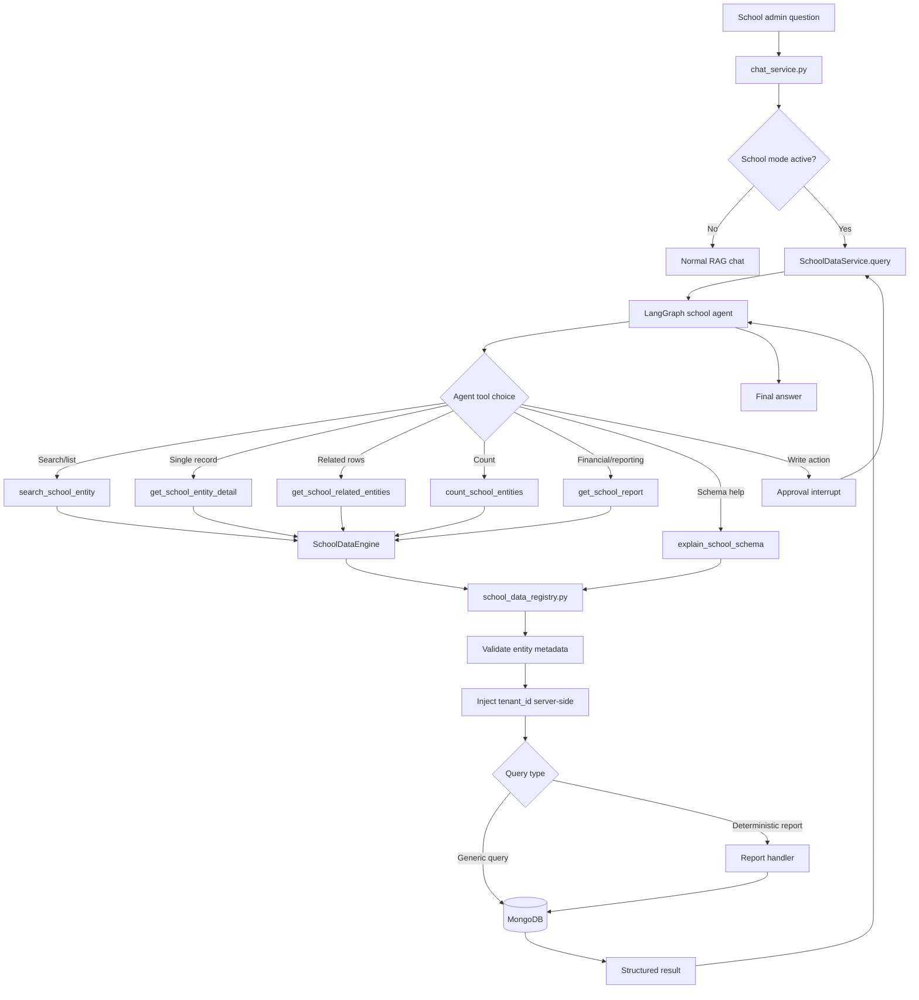

## Main Files

| File | Role |
|---|---|
| `backend/services/school_data_service.py` | Entry point from chat service; invokes LangGraph and handles approval interrupts. |
| `backend/services/school_agent/graph.py` | LangGraph agent, routing, prompt rules, read-tool node, approval node. |
| `backend/services/school_agent/tools.py` | LangChain tools exposed to the agent. Includes new generic tools and legacy compatibility tools. |
| `backend/services/school_data_registry.py` | Metadata registry for entities, fields, operators, projections, sort fields, and relationships. |
| `backend/services/school_data_engine.py` | Safe generic query engine and deterministic report engine. |
| `backend/services/school_data_filter.py` | Older per-collection allowlist helper still used by legacy table-specific tools. |
| `backend/tests/test_school_data_engine.py` | Tests for registry validation, tenant isolation, limit metadata, and due-fee report arithmetic. |

## Why This Supports 200 Tables

Do not add one tool per collection. Add metadata for each new table in
`school_data_registry.py`.

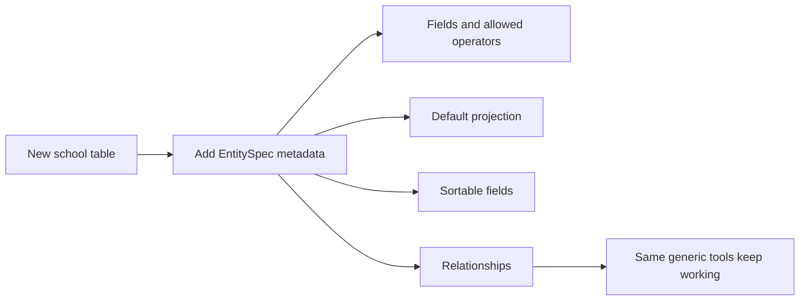

The agent keeps a small tool surface:

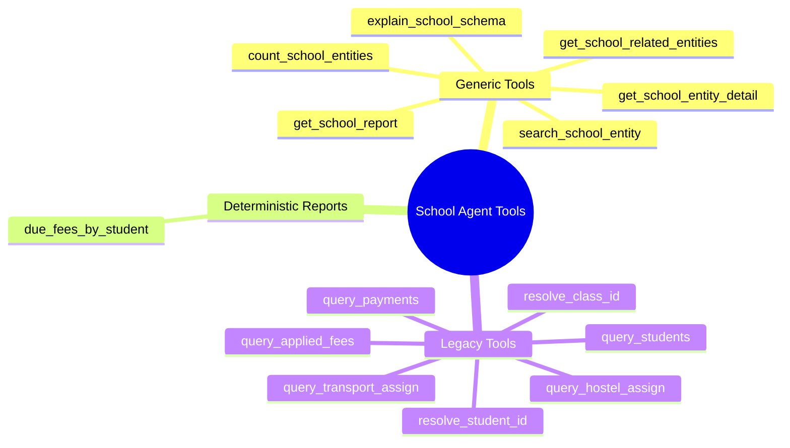

## Registry Model

`school_data_registry.py` defines:

- `FieldSpec`: field type, allowed operators, searchable flag, sortable flag.
- `RelationshipSpec`: target entity, local key, foreign key, relationship type.
- `EntitySpec`: entity name, collection, primary key, display name, fields,
  default projection, and relationships.

Example shape:

```python
"student": EntitySpec(
    entity="student",
    collection="school_students",
    primary_key="student_id",
    display_name="Student",
    fields={
        "student_id": FieldSpec("number", ("$eq", "$in")),
        "student_name": FieldSpec("string", ("$eq", "$regex", "$in")),
        "class_id": FieldSpec("number", ("$eq", "$in")),
    },
    default_projection=("student_id", "admission_no", "student_name", "class_id"),
    relationships={
        "fees": RelationshipSpec("applied_fee", "student_id", "student_id"),
        "payments": RelationshipSpec("payment", "student_id", "student_id"),
    },
)
```

Current registered entities:

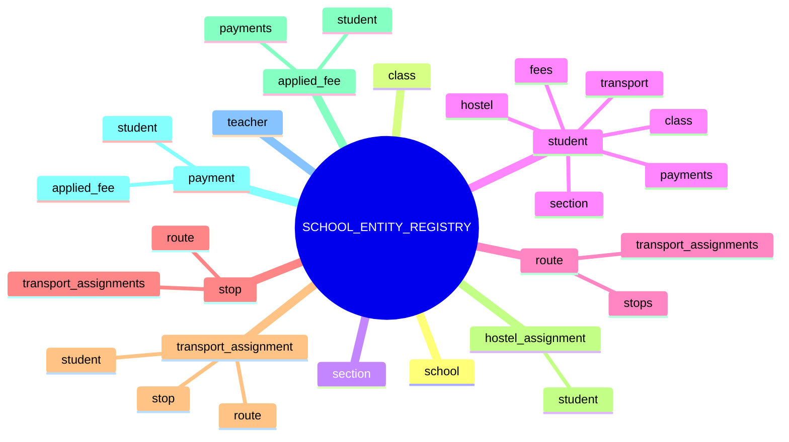

## Generic Query Engine

`SchoolDataEngine` runs all generic reads through registry validation.

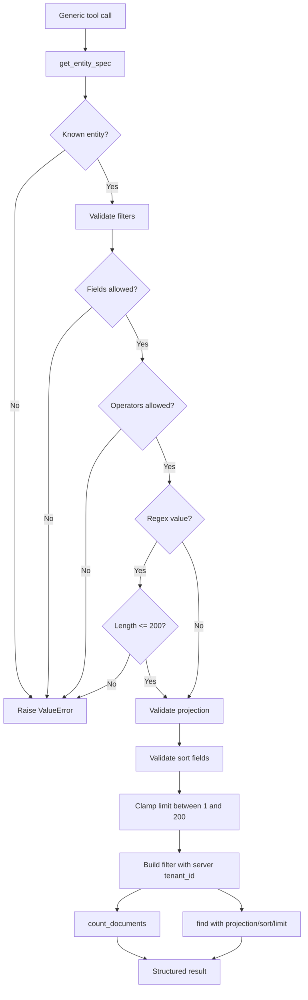

Generic search result shape:

```json
{
  "entity": "student",
  "collection": "school_students",
  "filter": {
    "$and": [
      {"tenant_id": "tenant_abc"},
      {"class_id": {"$eq": 10}}
    ]
  },
  "total_count": 25,
  "returned_count": 20,
  "has_more": true,
  "limit": 20,
  "rows": []
}
```

The important metadata is `has_more`. If `has_more` is true, the agent is
instructed to tell the user the list is limited.

## Due Fees Report

Financial totals should not be calculated by the LLM from limited rows. The
due-fee report is deterministic:

```text
get_school_report(report_id="due_fees_by_student")
```

It calculates:

```text
due_amount = amount - concession
```

from `school_applied_fees`. By default it includes:

```text
Pending + Partial
```

Statuses can be safely filtered, for example:

```json
{"statuses": ["Pending"]}
```

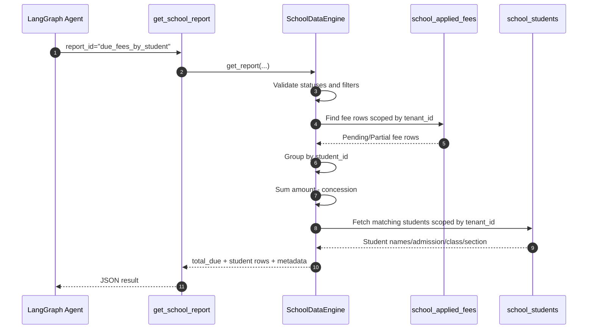

Returned shape:

```json
{
  "report_id": "due_fees_by_student",
  "calculation_basis": "Due amount = sum(amount - concession) from school_applied_fees for selected statuses. Payments are not subtracted in this report.",
  "statuses": ["Pending", "Partial"],
  "total_due": "243800",
  "student_count": 26,
  "fee_record_count": 36,
  "total_count": 26,
  "returned_count": 26,
  "has_more": false,
  "limit": 200,
  "rows": [
    {
      "student_id": 1,
      "student_name": "Ansh Sharma",
      "admission_no": "ADM001",
      "class_id": 4,
      "section_id": 1,
      "due_amount": "11000",
      "fee_record_count": 1,
      "breakdown": []
    }
  ]
}
```

Because `total_due` and `rows` come from the same backend calculation, answers
like "total due" and "student list with due amount" stay consistent.

## Manoj Sir Mismatch Root Cause

The earlier mismatch happened because the agent used low-level tools and the
LLM tried to combine limited/incomplete rows.

Problem pattern:

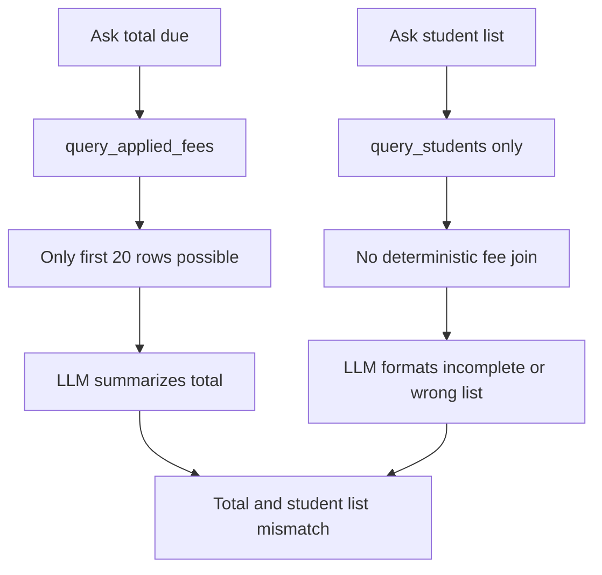

Fixed pattern:

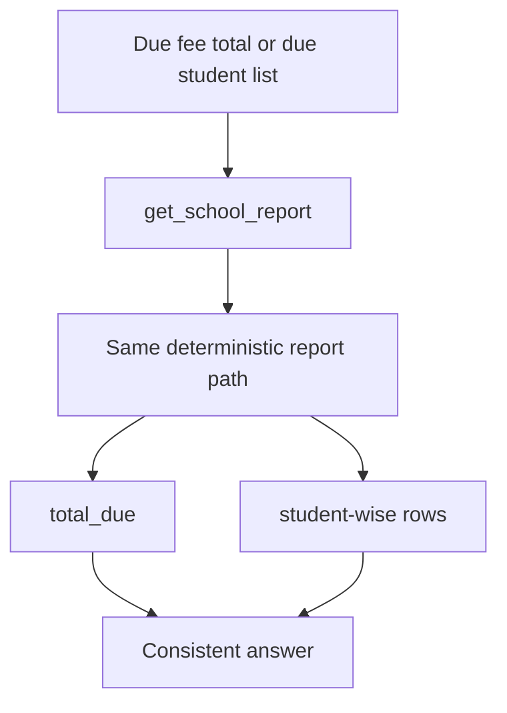

## `SchoolDataService.query()` Flow

`SchoolDataService.query()` remains the entry point for school mode.

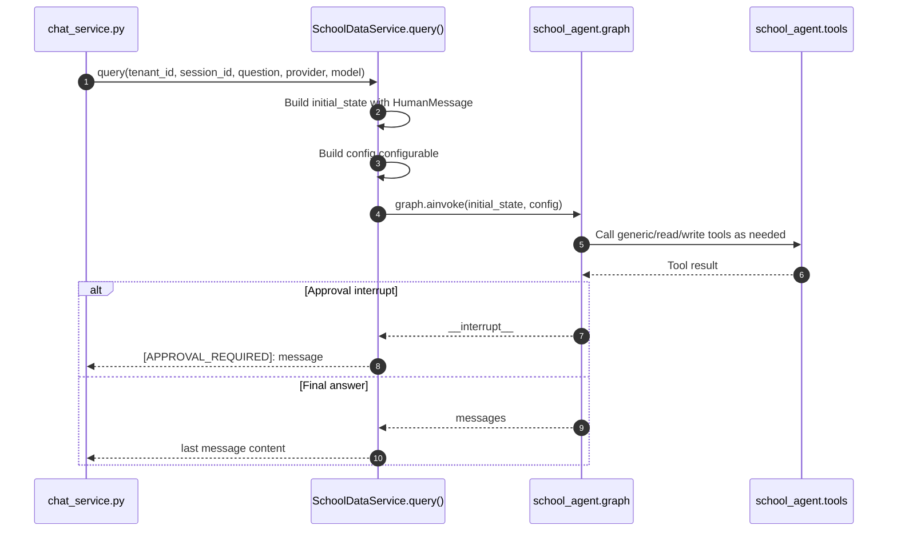

## Write Actions

Write tools are still guarded by the approval node and feature flag.

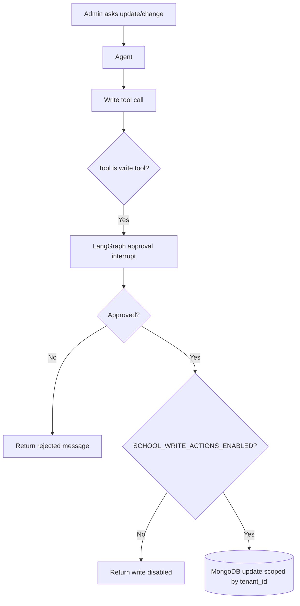

## Legacy `school_data_filter.py`

`school_data_filter.py` still protects older table-specific tools like
`query_students`, `query_applied_fees`, and resolver tools. It uses
`FIELD_ALLOWLIST` per collection.

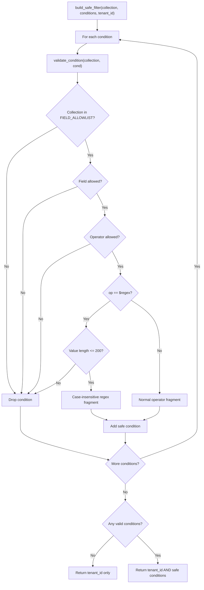

The new `SchoolDataEngine` is stricter: invalid fields/operators raise errors
instead of silently dropping conditions. That is better for generic tools
because the agent can see that it asked for something invalid.

## Real Query Example

Admin asks:

```text
Class 5 ke students dikhao
```

Agent should call:

```json
{
  "tool": "search_school_entity",
  "args": {
    "entity": "student",
    "filters": [
      {"field": "class_id", "op": "$eq", "value": 5}
    ],
    "limit": 50
  }
}
```

Backend builds:

```python
{
    "$and": [
        {"tenant_id": "current_school_tenant"},
        {"class_id": {"$eq": 5}}
    ]
}
```

Admin asks:

```text
Pure school ki due fees aur student-wise amount batao
```

Agent should call:

```json
{
  "tool": "get_school_report",
  "args": {
    "report_id": "due_fees_by_student",
    "filters": {
      "statuses": ["Pending", "Partial"]
    },
    "limit": 200
  }
}
```

The backend returns the total and student rows from the same calculation.

## Adding A New Table

To add a new ERP table:

1. Add an `EntitySpec` to `SCHOOL_ENTITY_REGISTRY`.
2. Define safe fields and operators.
3. Define `default_projection`.
4. Mark sortable/searchable fields.
5. Add relationships to other entities if needed.
6. Add a deterministic report only if the table needs business-critical
   calculations.
7. Add tests for validation and any new report logic.

You do not need to add a new LangGraph tool unless the capability is truly new.

## Tests

Run the backend tests with:

```bash
PYTHONPATH=backend uv run python -m unittest discover -s backend/tests -p "test_*.py" -v
```

Important test coverage:

- `test_school_query_safety.py`: legacy filter safety.
- `test_school_data_engine.py`: registry validation, tenant isolation, due-fee
  report totals, and limit metadata.
- `test_school_agent.py`: LangGraph agent behavior, resolver tools, write
  approval flow, and audit logging.

## Security Invariants

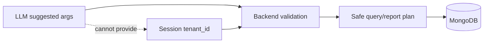

- The LLM never sends raw MongoDB queries.
- `tenant_id` is always injected from server/session context.
- Unknown entities, fields, operators, projections, sort fields, and
  relationships are rejected.
- Generic query limits are clamped.
- Financial totals are calculated by deterministic backend reports.
